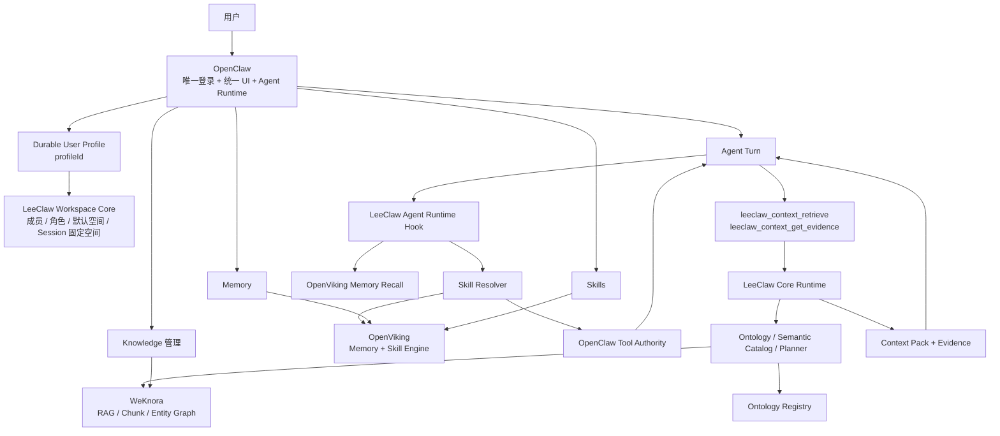

# LeeClaw v0.8

> **OpenClaw Agent Runtime + WeKnora Knowledge + OpenViking Memory & Skill**

LeeClaw 以 OpenClaw 为唯一产品主干和 Agent Runtime，把 WeKnora 的企业知识能力、OpenViking 的长期记忆与 Skill 能力接入同一个运行时。自研代码只补三者之间缺失的 Workspace、Knowledge Runtime、本体语义、检索治理和安全边界，不重写三个上游已经成熟的能力。

v0.8 的主题是：**让 Agent 真正使用 Skill 和 Knowledge。**

v0.7 完成了多人、多 Workspace 和 Knowledge 管理面；v0.8 进一步把这些能力接入每一次 OpenClaw Agent Turn：自动发现并加载当前 Workspace 的 Skill，通过 OpenClaw 原生工具检索企业知识和证据，并把 Skill 的工具声明收敛到 OpenClaw 已批准的工具面内。

---

## 1. 总体架构



核心边界保持不变：

- **OpenClaw**：人类账号、UI、Agent Runtime、最终 Tool Authority；
- **WeKnora**：企业文档、KB、Wiki、FAQ、RAG、Entity Graph 等 Knowledge Engine；
- **OpenViking**：Memory、Session、Experience、Skill 的唯一 Source of Truth；
- **LeeClaw**：Workspace、Ontology、Retrieval、Context、Adapter 和跨系统治理。

---

## 2. v0.8 的 Agent 运行链

一次普通对话现在按下面的顺序运行：

```text
用户问题
  ↓
OpenClaw Agent Session
  ↓
从 Session createdActor 恢复 OpenClaw profileId
  ↓
Workspace Core 固定本 Session 的 Workspace
  ↓
┌─────────────────────────────────────┐
│ OpenViking Runtime                  │
│ 1. Memory Recall                    │
│ 2. Skill Semantic Find              │
│ 3. 加载完整 SKILL.md                │
│ 4. allowed-tools ∩ Tool Authority   │
└─────────────────────────────────────┘
  ↓
OpenClaw 构造本 Turn Prompt + Tool Surface
  ↓
Agent 按需调用 LeeClaw Knowledge Tool
  ↓
Ontology / Planner / WeKnora / Evidence
  ↓
Context Pack
  ↓
模型回答 / Tool 执行
  ↓
OpenViking Capture / Commit
```

三个概念的职责必须区分：

> **Skill 决定“这类任务应该怎么做”；Knowledge 决定“企业事实是什么”；Memory 帮 Agent 理解“这个用户和历史上下文是什么”。**

Memory 不能代替企业事实，Skill 也不能自行授予工具权限。

---

## 3. Skill Runtime

v0.8 将 OpenViking Skill 从“管理资产”接入了 OpenClaw 当前 Agent Turn。

### 3.1 分层加载

```text
用户问题
  ↓
OpenViking /skills/find
  ↓
L0/L1 候选 + score threshold
  ↓
个人 Skill 优先，共享 Skill 次之
  ↓
选中一个 Skill
  ↓
Level 2 获取完整 SKILL.md
  ↓
只把正文作为当前 Turn 的业务执行规程
```

v0.8 每个 Turn 最多自动激活一个 Skill，避免多个 SOP 同时注入导致规则冲突。

### 3.2 个人 Skill 与共享 Skill

OpenViking 两类 Skill 都保留：

```text
viking://user/{profileId}/skills/...   个人 Skill
viking://agent/skills/...              Workspace 共享 Skill
```

Resolver 使用稳定优先级：

```text
个人 Skill
  > Workspace 共享 Skill
  > 同一作用域内按语义分数降序
```

这样用户自己的已确认工作方法可以覆盖同类共享方法，同时共享 Skill 仍作为组织默认能力。

### 3.3 Skill 不能扩权

Skill 中的 `allowed-tools` / `allowed_tools` 只是一项**限制声明**。

最终工具集合为：

```text
OpenClaw 当前 Turn 已批准工具
            ∩
Skill 声明允许的工具
```

Skill 无权增加 OpenClaw 没有批准的 Tool。显式空 `allowed-tools` 表示当前 Skill 禁止所有可选 Tool。

v0.8 支持确定性别名：

```text
context.retrieve       → leeclaw_context_retrieve
context.get_evidence   → leeclaw_context_get_evidence
Read / Write / Edit    → read / write / edit
Bash                   → exec
WebSearch / WebFetch   → web_search / web_fetch
```

类似 `Bash(git:*)` 这种带参数级限制的 token，如果当前 Host 无法等价表达，就不会被粗暴扩大成 unrestricted `exec`。

---

## 4. Knowledge Runtime

Knowledge 管理页面和 Agent 检索通道继续分离。

### 管理通道

```text
用户
  → OpenClaw Knowledge UI
  → leeclaw.knowledge.* Gateway Contract
  → Workspace / Role Gate
  → WeKnora Adapter
  → WeKnora
```

### Agent 通道

```text
OpenClaw Agent
  → leeclaw_context_retrieve
  → LeeClaw Core Runtime
  → Semantic Catalog / Planner
  → WeKnora RAG + Ontology
  → Arbiter / Context Pack
```

Agent 面只暴露两个窄工具：

```text
leeclaw_context_retrieve
leeclaw_context_get_evidence
```

模型看不到 Tenant、Account、API Key、External User 等身份字段。

### `leeclaw_context_retrieve`

输入只有业务语义：

```text
query
knowledge_base_id?   # 必须属于当前 Workspace
business domain?
task type?
```

服务端补齐：

```text
OpenClaw profileId
Workspace
WeKnora Tenant
Service Credential
Knowledge Base Scope
```

然后执行：

```text
Ontology Binding
  → Semantic Catalog
  → Retrieval Planner
  → Retriever
  → Arbiter
  → Context Pack
```

### `leeclaw_context_get_evidence`

Agent 只能提交 `chunk_id`。服务端会再次校验该 chunk 所属 Knowledge Base 是否仍在当前 Workspace 允许范围内，不能用已知 chunk id 绕过 Workspace KB Scope。

---

## 5. Workspace：默认空间与会话空间分开

v0.8 对 v0.7 的 Workspace 语义做了关键修正。

### UI 默认 Workspace

用户在管理页面切换 Workspace：

```text
profileId → default workspace
```

它决定新 Knowledge 页面请求以及**后续新 Agent Session** 的默认空间。

### Agent Session Workspace

一个 Agent Session 第一次运行时：

```text
OpenClaw Session createdActor
  → profileId
  → 当前 default workspace
  → Session Workspace Binding
```

绑定后，同一个 Session 不会因为用户随后在页面切换 Workspace 而改变作用域。

例如：

```text
Session A 在“重庆公司”开始
  ↓
用户把页面默认空间切到“总部”
  ↓
Session A 继续固定“重庆公司”
  ↓
/new 或 /reset 后的新 Session B 使用“总部”
```

这避免同一段对话历史跨 Workspace 继续检索 Knowledge、Memory 或 Skill。

Session binding 使用哈希键写入 v0.8 state，不持久化原始 session id。用户失去某 Workspace membership 后，该 Workspace 的既有 Session 会 fail closed，而不会静默切到另一个空间。

---

## 6. 身份与下游映射

唯一人类身份仍然是：

```text
OpenClaw authenticatedUserProfile.profileId
```

Workspace 解析完成后：

```text
WeKnora:
  X-API-Key          = 当前 Workspace 对应服务凭证
  X-Tenant-ID        = 当前 Workspace Tenant
  X-External-User-ID = OpenClaw profileId

OpenViking:
  X-OpenViking-Account = 当前 Session Workspace Account
  X-OpenViking-User    = OpenClaw profileId
```

浏览器无权提供这些可信字段。

---

## 7. Knowledge 管理能力继续保留

v0.7 已完成的 OpenClaw 原生 Knowledge 管理面全部保留：

```text
Knowledge Base CRUD
Documents：文件 / URL / 手工知识 / 重解析 / 取消 / 删除
Wiki CRUD
FAQ CRUD
Tags CRUD
Hybrid Search
Entity Graph
Ontology Graph
Organization Share
Workspace Member / Role
LeeClaw Audit
```

WeKnora 仍然是 Knowledge Engine，OpenClaw 前端不复制 WeKnora 后端业务规则。

---

## 8. 本体在 v0.8 的位置

本体仍属于 Knowledge：

```text
Knowledge
├─ 文档 / Wiki / FAQ / RAG   → WeKnora
├─ Entity Graph              → WeKnora GraphRAG / Neo4j
└─ Ontology Graph            → LeeClaw Ontology Registry
```

实体图和本体图统一投影为稳定 `GraphView`，但底层生命周期不合并。

v0.8 中本体开始真正参与 Agent Runtime：

```text
Knowledge Base Binding
  → Ontology
  → Semantic Catalog
  → Planner
  → Source Selection
```

当前一个请求只有在明确收敛到单个 Knowledge Base 时才加载该 KB 的绑定本体；多 KB 本体合并仍留到后续版本，避免把不同本体空间粗暴拼接。

---

## 9. RAG fallback 的原则

如果 Ontology Planner 判断应查询结构化/实时业务来源，但当前还没有对应 Retriever，LeeClaw 可以补一次当前 Workspace 的 WeKnora RAG 证据用于解释。

但是：

```text
RAG evidence ≠ live structured fact
```

因此 fallback 不会删除原来的 Gap，也不会把 `complete=false` 错改为 `true`。

---

## 10. Source of Truth

| 资产 | Source of Truth |
|---|---|
| 人类账号 / Profile | OpenClaw |
| Agent Runtime / Tool Authority | OpenClaw |
| Workspace Membership / Role / Session Binding | LeeClaw Workspace Core |
| KB / 文档 / Wiki / FAQ / RAG | WeKnora |
| Entity Graph | WeKnora |
| Ontology / Binding / Version | LeeClaw Ontology Registry |
| Memory / Session / Experience | OpenViking |
| Skill | OpenViking |
| 实时业务事实 | 业务 API / MCP |

任何新功能开发前先确定唯一 Source of Truth，禁止建立第二份可写主数据。

---

## 11. 代码结构

```text
cobra-knowledge/
├─ integrations/openclaw/
│  ├─ workspace-core/          # Workspace / Role / Session binding
│  ├─ knowledge-plugin/        # Knowledge UI + Agent Knowledge Tools
│  └─ openviking-plugin/       # Memory + Dynamic Skill Runtime
├─ internal/
│  ├─ runtimecontext/          # 在线 Knowledge Runtime
│  ├─ retrieval/               # Semantic Catalog / Planner / Arbiter
│  ├─ context/                 # Retriever / Context Pack
│  ├─ ontology/                # Ontology Registry
│  ├─ graphview/               # Entity/Ontology GraphView
│  └─ adapters/weknora/        # WeKnora Adapter
├─ configs/
├─ compatibility/
└─ scripts/

upstream/
├─ openclaw/
├─ openviking/
└─ weknora/
```

三个 `upstream/` 仍是独立 submodule。LeeClaw 功能代码不写入上游目录。

---

## 12. 上游同步策略

v0.8 当前固定验证：

```text
OpenClaw   v2026.9.3
WeKnora    v0.8.0
OpenViking v0.4.19
```

升级顺序：

```text
移动 upstream commit
  → Upstream Contract Gate
  → Adapter / Runtime Contract Test
  → Derived OpenClaw Assembly
  → Full Build / E2E
  → 只在 Plugin / Adapter 边界吸收差异
```

要求继续保持：

```text
OpenClaw upstream modified files: 0
WeKnora upstream modified files: 0
OpenViking upstream modified files: 0
```

---

## 13. 配置与验证

配置：

```text
cobra-knowledge/configs/openclaw-v0.8.example.json
cobra-knowledge/configs/workspaces-v0.8.example.json
```

本地门禁：

```bash
cd cobra-knowledge
./scripts/verify-v0.8.sh
```

上游契约：

```bash
./scripts/check-v0.8-upstreams.sh \
  ../upstream/openclaw \
  ../upstream/weknora \
  ../upstream/openviking
```

派生 OpenClaw：

```bash
./integrations/openclaw/apply-integration.sh \
  ../upstream/openclaw \
  ../build/openclaw-v0.8
```

---

## 14. v0.8 当前边界

v0.8 已完成“Agent 能动态使用 Skill + 企业 Knowledge”的第一条生产化主链，但仍明确保留这些边界：

- 每个 Turn 只自动激活一个 Skill；
- 不自动执行 OpenViking Skill 包中的任意辅助脚本/文件；
- 结构化 Entity Retriever 和实时 Business Retriever 需要后续按业务系统接入；
- 多 Knowledge Base 的本体联合推理尚未启用；
- Workspace Registry / Session state / Audit / Ontology FSRegistry 当前仍是单 Gateway/单实例基线；
- Control UI 大文件流式上传尚未完成；
- Memory → Knowledge、Experience → Skill 的 Promotion Gate 尚未进入 v0.8；
- 完整 CI、HA、全链路 Trace/Eval 仍属于生产化阶段；
- 完整 OpenClaw `pnpm` bundle / E2E 只有在依赖完整的 CI 环境真实跑通后才能标记通过。

后续版本应继续在这些边界上增量增强，不回到修改三个上游内核的路线。
