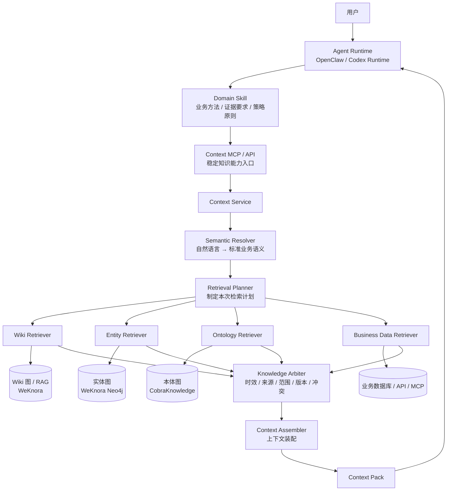
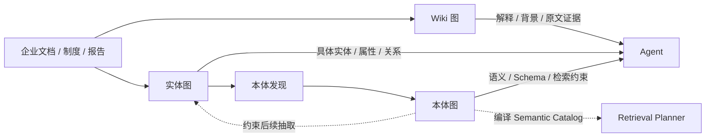
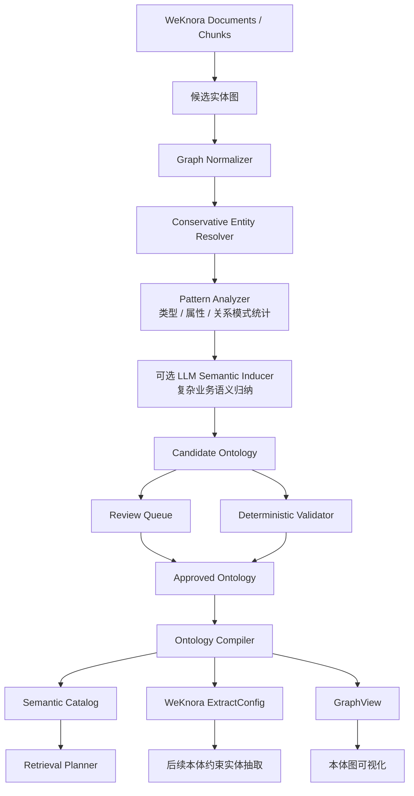
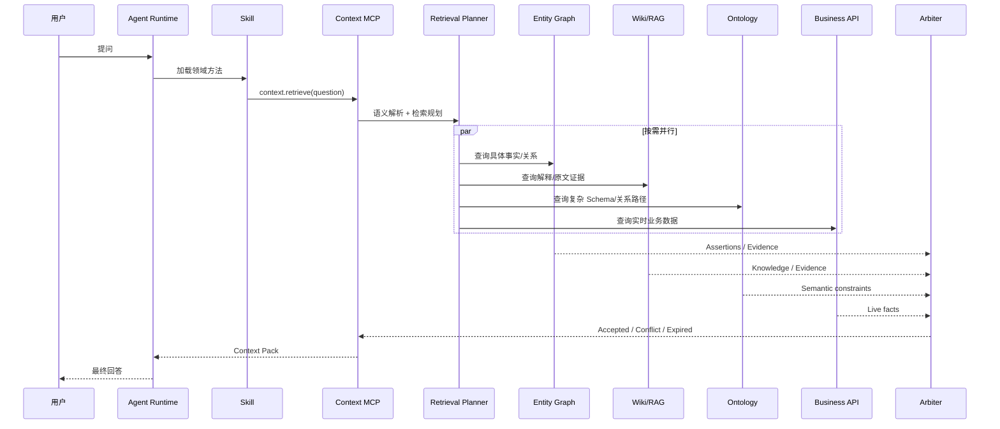
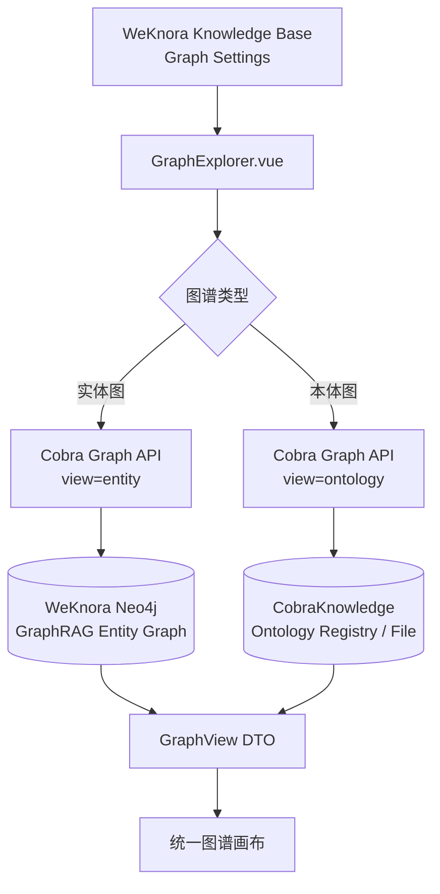
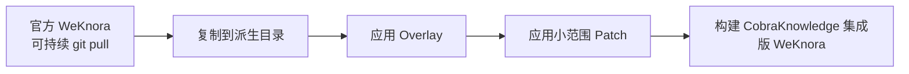
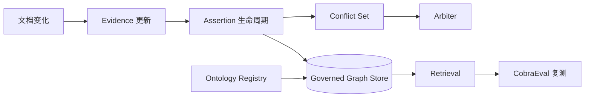

# CobraKnowledge v0.3

> 面向企业 Agent 的检索、知识图谱、本体与上下文治理内核

CobraKnowledge 的目标，是让 Agent 在企业场景中能够**找到正确的知识、判断知识是否可信、处理知识冲突与时效问题，并把足够且可追溯的上下文交给大模型推理**。

当前版本：`v0.3.0`

- 核心实现：Go
- WeKnora：作为文档、Chunk、RAG、Wiki、实体图等知识底座之一
- Semantica：仅作为本体、Provenance、Conflict、Validation 等方法研究参考
- Agent Runtime：可对接 OpenClaw、Codex Runtime 等
- 运行时不依赖 Semantica，也不直接修改 WeKnora 业务内核

---

## 目录

- [1. 项目定位](#1-项目定位)
- [2. 总体架构](#2-总体架构)
- [3. 每个模块负责什么](#3-每个模块负责什么)
- [4. 三张图分别负责什么](#4-三张图分别负责什么)
- [5. 本体是怎么构建出来的](#5-本体是怎么构建出来的)
- [6. Agent 在线检索怎么运行](#6-agent-在线检索怎么运行)
- [7. 知识冲突和过期怎么处理](#7-知识冲突和过期怎么处理)
- [8. v0.3：WeKnora 页面显示本体图](#8-v03weknora-页面显示本体图)
- [9. Skill、MCP、Planner、Arbiter 的边界](#9-skillmcpplannerarbiter-的边界)
- [10. 工程目录](#10-工程目录)
- [11. 快速开始](#11-快速开始)
- [12. Graph API](#12-graph-api)
- [13. WeKnora 前端 Overlay](#13-weknora-前端-overlay)
- [14. MCP Runtime](#14-mcp-runtime)
- [15. Prompt 与 Skill](#15-prompt-与-skill)
- [16. 与 WeKnora / Semantica 的关系](#16-与-weknora--semantica-的关系)
- [17. 当前实现状态](#17-当前实现状态)
- [18. 后续路线](#18-后续路线)

---

## 1. 项目定位

CobraKnowledge 并不把“知识库”“向量检索”“知识图谱”“本体”看成几个彼此独立的功能。

我们真正要建设的是一套：

> **企业 Agent 检索与上下文治理体系。**

三张图只是知识资产。真正决定 Agent 准确率的，是一套完整的**检索策略**：

1. 用户到底在问什么；
2. 需要什么实体、属性、关系和时间范围；
3. 应该查询 Wiki、实体图、本体图，还是实时业务系统；
4. 哪些查询可以并行；
5. 哪些结果可信；
6. 多个来源冲突时相信谁；
7. 旧知识在什么场景下仍然有效；
8. 证据达到什么程度才允许回答；
9. 什么时候应该继续检索；
10. 什么时候必须停止自动判断并交给人工。

因此 CobraKnowledge 的核心并不是某一张图，而是：

```text
Ontology
   ↓
Semantic Catalog
   ↓
Retrieval Planner
   ↓
Multi-source Retrieval
   ↓
Knowledge Arbiter
   ↓
Context Assembler
   ↓
Context Pack
```

---

## 2. 总体架构



这套架构中，Agent 不需要知道 Neo4j 的 Label、Cypher、Ontology JSON、WeKnora API 路径等底层细节。

Agent 面对的是少量稳定工具；真正复杂的检索路由、冲突判断和上下文拼装，由 CobraKnowledge 内部完成。

---

## 3. 每个模块负责什么

| 模块 | 主要职责 | 不负责什么 |
|---|---|---|
| Agent Runtime | 会话、模型、Skill 加载、工具执行、权限、轨迹 | 不保存企业知识，不定义领域本体 |
| Skill | 业务方法、判断步骤、证据要求、工具使用原则 | 不保存实时业务事实，不写底层 Cypher/API |
| MCP / API | 向 Agent 暴露稳定的标准能力 | 不自行决定业务流程 |
| Semantic Resolver | 把自然语言映射为标准 Class / Property / Relation / Entity | 不负责大量知识检索 |
| Retrieval Planner | 决定本次查什么、去哪查、如何并行、何时停止 | 不直接裁定多个事实谁正确 |
| Retriever | 按计划执行 Wiki、实体图、本体图、业务数据查询 | 不自行做高层业务推理 |
| Knowledge Arbiter | 判断时效、来源权威、范围、版本和冲突 | 不负责用户意图理解 |
| Context Assembler | 将事实、关系、知识、证据、冲突整理为统一上下文 | 不重新创造业务事实 |
| Wiki 图 | 长文本知识、背景、解释、章节、原文证据 | 不适合作为实时状态唯一来源 |
| 实体图 | 具体对象、状态、属性、事实关系 | 不负责定义业务世界的 Schema |
| 本体图 | Class、Property、Relation、Hierarchy、约束、检索语义 | 不保存海量具体实例事实 |
| Business MCP/API | 提供实时业务数据和系统能力 | 不承担文档知识治理 |

一句话概括：

> **Skill 管方法，Planner 管策略，MCP 管能力，三张图管知识，Arbiter 管可信度，Context Assembler 管上下文，Runtime 管执行。**

---

## 4. 三张图分别负责什么

CobraKnowledge 当前把企业知识明确拆成三类图。



### 4.1 Wiki 图

Wiki 图关注的是：

> **知识内容之间如何关联。**

典型内容包括：

- Wiki 页面；
- 主题；
- 章节；
- 概念介绍；
- 上下游页面链接；
- 原文引用；
- 解释性知识。

主要用于：

- 为什么；
- 有什么依据；
- 某项规定怎么解释；
- 某个问题在报告中是怎么分析的；
- 给实体事实补充原文证据。

当前继续使用 WeKnora 的 Wiki / RAG 能力。

### 4.2 实体图

实体图关注的是：

> **企业世界里具体有哪些对象，它们有什么事实和关系。**

例如：

```text
宾川县
  └─包含→ 金牛变电站
              └─供出→ 金牛线
                        └─供电→ XX台区
```

以及：

```text
金牛线
- 电压等级 = 10kV
- 转供状态 = 不可转供
- 所属变电站 = 金牛变电站
```

当前实体图主要来自 WeKnora GraphRAG，并保存在 Neo4j 中。

### 4.3 本体图

本体图关注的是：

> **业务世界应该如何被定义。**

例如：

```text
线路
├─ 属性：电压等级
├─ 属性：长度
├─ 属性：转供状态
├─ 关系：所属 → 变电站
└─ 关系：供电 → 台区
```

本体中不仅保存业务语义，还逐步承载检索策略：

```text
Property：转供状态

preferred_sources:
1. GIS
2. PMS
3. PlanningDocument

freshness:
change_driven

conflict_policy:
authority_first
```

因此，本体并不仅仅用于“画图”，还用于：

- 语义消歧；
- 属性归属判断；
- 合法关系判断；
- 检索源选择；
- 来源优先级；
- 新鲜度策略；
- 冲突策略；
- 后续实体抽取约束。

---

## 5. 本体是怎么构建出来的

CobraKnowledge 采用：

> **Bottom-up 发现 + Top-down 治理。**

先从真实业务文档和实体图中发现业务结构，再经过审核形成正式本体，之后由正式本体反过来约束后续知识抽取。



### 代码与大模型的分工

**代码负责确定性工作：**

- 类型频率统计；
- 属性分布；
- Relation Domain / Range 统计；
- ID 生成；
- Schema 校验；
- 高风险变更门禁；
- 本体版本；
- 检索策略执行；
- 冲突规则执行。

**大模型负责真正需要语义理解的工作：**

- 两个概念是不是同一业务含义；
- 同名词是否属于不同业务 Sense；
- 某个 Relation 应该合并还是拆分；
- 复杂业务规则如何形式化；
- 新概念应该落在哪个本体层级。

原则是：

> **能确定性判断的事情不交给 LLM，只有真正需要语义理解的事情才调用 LLM。**

---

## 6. Agent 在线检索怎么运行



### Planner 的目标不是“多查”

Planner 的目标是：

> **最小充分检索。**

例如用户问：

> 金牛线属于哪个变电站？

通常只查询实体图。

用户问：

> 金牛线为什么需要改造？

可以并行查询：

- 实体图：线路 → 问题 → 措施；
- Wiki/RAG：规划报告中的分析依据。

用户问：

> 金牛线当前最大负载率是多少？

优先查实时业务系统，不应该拿两年前报告中的负载率回答“当前”。

---

## 7. 知识冲突和过期怎么处理

企业知识不能简单采用“最新一条覆盖旧值”的方式。

CobraKnowledge 将实体身份和事实分开。

### Entity

表示稳定身份：

```text
Entity
- id
- canonical_name
- type_id
- aliases
```

### Assertion

表示某个来源对事实的主张：

```text
Assertion
- subject
- predicate
- object / value
- scope
- valid_from
- valid_to
- observed_at
```

### Evidence

表示事实证据来自哪里：

```text
Evidence
- document_id
- chunk_id
- source
- source_type
- published_at
- observed_at
- confidence
```

例如：

```text
金牛线 - 转供状态

Assertion A
值：不可转供
来源：2024规划报告
有效时间：2024

Assertion B
值：可转供
来源：PMS
观测时间：2026-09-10
```

这两条知识不会互相覆盖。

### Arbiter 判断维度

Knowledge Arbiter 综合判断：

- 用户问题要求的时间；
- valid time；
- observed time；
- source authority；
- scope；
- version；
- freshness；
- ontology consistency；
- confidence；
- evidence completeness。

如果无法形成决定性结论，则返回：

```text
unresolved_conflict
```

而不是让大模型强行选一个。

如果后续涉及业务写操作，则可以直接阻断自动执行并要求人工确认。

---

## 8. v0.3：WeKnora 页面显示本体图

v0.3 增加了一个重要能力：

> **在 WeKnora 原有知识库图谱区域中，直接切换查看“实体图 / 本体图”。**



### 为什么增加 GraphView

前端不直接消费 Neo4j 数据，也不直接消费 Ontology JSON。

两种图统一转换为：

```text
GraphView
├─ nodes[]
│  ├─ id
│  ├─ label
│  ├─ kind
│  ├─ group
│  └─ metadata
├─ edges[]
│  ├─ source
│  ├─ target
│  ├─ label
│  ├─ kind
│  └─ metadata
└─ meta
```

这样以后：

- 本体从 JSON 切换到 Neo4j；
- 实体图 Schema 改变；
- WeKnora GraphRAG 升级；

都只需要修改 Adapter，不需要重新改前端画布。

### 本体图当前显示

- Class；
- Data Property；
- Object Relation；
- Class Hierarchy；
- Domain → Property；
- Domain → Relation → Range。

### 权限

Graph API 不自建另一套用户体系。

浏览器的：

```text
Authorization
X-Tenant-ID
```

会转交给 WeKnora 标准知识库 API 做 RBAC 校验。

因此没有知识库访问权限的用户，也无法绕过 WeKnora 权限直接读取该知识库的本体图。

---

## 9. Skill、MCP、Planner、Arbiter 的边界

这几个模块容易混淆，当前设计明确分层。

### Skill：这件事应该怎么做

Skill 保存的是领域方法，例如：

```text
配网规划分析：
1. 先识别区域、线路、台区等对象；
2. 获取线路状态；
3. 获取存在的问题；
4. 获取规划依据；
5. 获取措施和项目；
6. 当前运行指标必须查询实时业务源；
7. 所有结论必须可回溯证据；
8. 存在未解决冲突时不得虚构统一结论。
```

Skill 不应该写死：

- Neo4j Cypher；
- REST URL；
- 数据库密码；
- 某条线路具体数值。

### MCP：有哪些能力可以调用

Agent 面向 MCP 看到的是少量稳定工具。

当前生产主入口：

```text
context.retrieve
context.get_evidence
```

未来可增加：

```text
context.expand
ontology.resolve
ontology.validate
data.query
```

### Planner：这一次具体怎么查

同一个 Skill 下，不同问题有不同 Retrieval Plan。

Planner 决定：

- 查询源；
- 查询实体类型；
- 查询属性；
- 查询关系；
- 是否并行；
- 是否需要证据；
- 停止条件。

### Arbiter：查到以后相信谁

Arbiter 不负责规划查询路径。

它负责：

- 来源优先级；
- 时间有效性；
- 新鲜度；
- Scope；
- 版本；
- 冲突；
- 证据充分性。

因此当前原则是：

> **Skill 保存策略和业务方法；Planner / Arbiter 负责稳定执行；复杂语义判断再按需交给 LLM。**

---

## 10. 工程目录

```text
Weknora-Semantica/
├── README.md
├── upstream/
│   └── README.md
│
└── cobra-knowledge/
    ├── VERSION
    ├── README.md
    ├── ARCHITECTURE.md
    ├── CHANGELOG.md
    ├── RELEASE-v0.2.md
    ├── RELEASE-v0.3.md
    │
    ├── cmd/
    │   ├── cobra/
    │   ├── context-mcp/
    │   └── graph-api/
    │
    ├── internal/
    │   ├── access/
    │   ├── adapters/
    │   ├── context/
    │   ├── graph/
    │   ├── graphview/
    │   ├── httpapi/
    │   ├── mcp/
    │   ├── model/
    │   ├── ontology/
    │   └── retrieval/
    │
    ├── configs/
    ├── prompts/
    ├── skills/
    ├── examples/
    ├── docs/
    │   ├── MODULES.md
    │   ├── DESIGN_DECISIONS.md
    │   └── GRAPH_VISUALIZATION.md
    │
    └── integrations/
        └── weknora/
            ├── overlay/
            ├── patches/
            └── apply-overlay.sh
```

### 关键目录说明

`internal/ontology`

- 本体发现；
- 本体校验；
- Ontology Registry；
- Ontology → Semantic Catalog；
- Ontology → WeKnora ExtractConfig。

`internal/graph`

- 实体归一；
- Assertion；
- Evidence；
- 事实结构化。

`internal/retrieval`

- Semantic Catalog；
- Retrieval Planner；
- Knowledge Arbiter。

`internal/context`

- 并行执行 Retriever；
- 汇总结果；
- 生成 Context Pack。

`internal/graphview`

- 实体图 → GraphView；
- 本体图 → GraphView；
- Neo4j 只读图源。

`integrations/weknora`

- WeKnora 前端 Overlay；
- GraphExplorer；
- 小范围 Patch；
- 非侵入式派生构建。

---

## 11. 快速开始

进入核心工程：

```bash
cd cobra-knowledge
```

运行测试：

```bash
make test
```

静态检查：

```bash
make vet
```

构建：

```bash
make build
```

### 从 WeKnora GraphData 生成候选本体

```bash
bin/cobra-knowledge bootstrap \
  -in examples/weknora-graph.json \
  -domain distribution_network \
  -out out/bootstrap
```

该流程完成：

```text
WeKnora GraphData
→ Graph Normalizer
→ Entity Resolver
→ Pattern Analyzer
→ Candidate Ontology
→ Validator / Review Queue
```

---

## 12. Graph API

v0.3 新增 `cobra-graph-api`。

先准备知识库与本体绑定配置：

```text
configs/ontology-bindings.example.json
```

环境变量示例：

```bash
export COBRA_NEO4J_URL=http://neo4j:7474
export COBRA_NEO4J_USER=neo4j
export COBRA_NEO4J_PASSWORD='***'

export COBRA_ONTOLOGY_BINDINGS=/app/configs/ontology-bindings.json

export COBRA_WEKNORA_BASE_URL=http://weknora:8080
export COBRA_GRAPH_AUTH_MODE=weknora
```

启动：

```bash
bin/cobra-graph-api -listen :8090
```

接口：

```text
GET /healthz

GET /api/v1/knowledge-bases/{kb_id}/graph?view=entity&limit=160

GET /api/v1/knowledge-bases/{kb_id}/graph?view=ontology
```

其中：

- `view=entity`：只读 WeKnora Neo4j 实体图；
- `view=ontology`：读取 CobraKnowledge 本体并投影；
- 两者统一返回 GraphView。

---

## 13. WeKnora 前端 Overlay

为了避免长期 Fork WeKnora，CobraKnowledge 不直接修改 upstream checkout。



执行：

```bash
./integrations/weknora/apply-overlay.sh \
  ../upstream/weknora \
  ../build/weknora-v0.3
```

建议使用同源 Nginx 反向代理：

```nginx
location /cobra-knowledge/ {
    proxy_pass http://cobra-graph-api:8090/;
    proxy_set_header Authorization $http_authorization;
    proxy_set_header X-Tenant-ID $http_x_tenant_id;
    proxy_set_header Accept-Language $http_accept_language;
}
```

如果 WeKnora 官方未来修改 `GraphSettings.vue` 导致 Patch 上下文失配，Overlay 应直接失败并提示适配，而不是静默覆盖官方新逻辑。

---

## 14. MCP Runtime

Agent 运行时推荐通过 Context MCP 使用 CobraKnowledge。

```bash
export COBRA_ONTOLOGY_FILE=/path/to/ontology.json
export COBRA_ENTITY_GRAPH_FILE=/path/to/normalized-graph.json

export WEKNORA_BASE_URL=http://localhost:8080
export WEKNORA_API_KEY=sk-xxxxx
export WEKNORA_KB_IDS=kb-1,kb-2

go run ./cmd/context-mcp
```

当前生产侧工具保持克制：

```text
context.retrieve
context.get_evidence
```

我们不建议向 Agent 暴露几十个：

```text
neo4j.query
ontology.getClass
wiki.search
vector.search
...
```

底层工具越多，模型每轮临场选择越多，执行路径越难稳定、评测和审计。

CobraKnowledge 的方向是：

> **Agent 少调用，Context Service 内部多路规划和并行检索。**

---

## 15. Prompt 与 Skill

### Prompt

`cobra-knowledge/prompts/` 当前包括：

- `ontology-semantic-induction.md`：候选本体复杂语义归纳；
- `ontology-review.md`：本体审核；
- `complex-retrieval-planner.md`：复杂检索规划；
- `semantic-conflict-judge.md`：无法用硬规则解决时的语义冲突辅助判断；
- `weknora-ontology-extraction.md`：本体约束下的实体/关系抽取。

### Skill

Skill 负责领域方法和检索原则。

目前围绕两个方向组织：

- 本体演进；
- 可信知识检索。

Skill 中适合保存：

```text
什么时候查询实时数据
什么时候必须补原文证据
什么情况不得自动裁决
哪些业务步骤不能跳过
输出必须包含哪些信息
```

不适合保存：

```text
当前业务事实
账号密码
Neo4j 物理 Schema
具体 API 地址
频繁变化的数据
```

---

## 16. 与 WeKnora / Semantica 的关系

### WeKnora

CobraKnowledge 使用 WeKnora 的优势能力：

- 文档管理；
- 文档解析；
- Chunk；
- Hybrid RAG；
- Wiki；
- GraphRAG 实体图；
- Knowledge Base 权限体系。

但通过 Adapter / API / Neo4j Read Adapter 解耦。

CobraKnowledge 不要求把自己的本体生命周期塞进 WeKnora GraphRAG Schema。

### Semantica

Semantica 当前定位为：

> **研究参考，而不是运行依赖。**

重点借鉴其：

- Graph-native ontology；
- ontology generation；
- provenance；
- entity resolution；
- conflict detection；
- ontology validation；
- ontology governance。

这些思想由 CobraKnowledge 自己重新设计和实现。

因此：

```text
Semantica 更新
不会导致 CobraKnowledge runtime 依赖升级

WeKnora 更新
主要影响 Adapter / Overlay
不会要求重写 Ontology / Planner / Arbiter
```

---

## 17. 当前实现状态

### v0.2 已完成

- Go 原生 CobraKnowledge Core；
- WeKnora GraphData Adapter；
- Graph Normalizer；
- 保守 Entity Resolver；
- Assertion / Evidence 模型；
- Bottom-up Ontology Discovery；
- Ontology Validator；
- Ontology Registry；
- Ontology Compiler；
- Semantic Catalog；
- Fast Retrieval Planner；
- Knowledge Arbiter；
- Context Service；
- Context MCP；
- Prompt；
- Skill。

### v0.3 已完成

- GraphView 稳定显示契约；
- Ontology → GraphView；
- WeKnora Neo4j HTTP 只读实体图；
- KB → Ontology Binding；
- `cobra-graph-api`；
- WeKnora RBAC 委托校验；
- WeKnora 页面“实体图 / 本体图”切换；
- GraphExplorer；
- 非侵入 Overlay 构建机制。

### v0.3 验证

- `go test ./...`：通过；
- `go vet ./...`：通过；
- Go 二进制构建：通过；
- Graph API health：通过；
- ontology graph API smoke：通过；
- WeKnora Overlay 应用：通过；
- 新增 TypeScript 代码语法检查：通过。

当前执行环境中 WeKnora 前端依赖安装发生超时，因此没有把完整 `npm build` 标记为已验证。

---

## 18. 后续路线

下一阶段重点不是继续堆更多页面，而是把知识生命周期补完整。

### v0.4 建议方向



优先建设：

1. Governed Graph Store；
2. 正式 Ontology Registry API；
3. Assertion / Evidence 持久化；
4. 文档增量更新与事实失效机制；
5. Conflict Set 生命周期；
6. 本体候选审核、批准、驳回、发布界面；
7. 图谱搜索和 Ego 局部展开；
8. 本体版本与检索评测结果联动；
9. “本体变更 → 重新抽取 → 检索复测 → 发布”的完整闭环。

最终希望形成：

> **知识建设、知识治理、检索规划、可信裁决、Agent 上下文装配、评测复测的一体化企业知识基础设施。**

---

## 详细文档

- [`cobra-knowledge/ARCHITECTURE.md`](cobra-knowledge/ARCHITECTURE.md) — 总体架构设计
- [`cobra-knowledge/docs/MODULES.md`](cobra-knowledge/docs/MODULES.md) — 代码模块职责
- [`cobra-knowledge/docs/DESIGN_DECISIONS.md`](cobra-knowledge/docs/DESIGN_DECISIONS.md) — 关键设计决策
- [`cobra-knowledge/docs/GRAPH_VISUALIZATION.md`](cobra-knowledge/docs/GRAPH_VISUALIZATION.md) — v0.3 图谱显示与 WeKnora 集成
- [`cobra-knowledge/RELEASE-v0.3.md`](cobra-knowledge/RELEASE-v0.3.md) — v0.3 Release 说明

---

## 设计原则

CobraKnowledge 当前坚持以下原则：

1. **知识资产与检索策略分离**；
2. **本体负责语义和约束，实体图负责事实，Wiki 负责解释和证据**；
3. **LLM 做语义判断，代码做确定性执行**；
4. **事实不覆盖，使用 Assertion + Evidence 表达来源和时间**；
5. **冲突无法确定时明确返回冲突，不让模型强行给结论**；
6. **在线查询优先最小充分检索，不默认遍历所有知识源**；
7. **Skill 保存业务方法，MCP 暴露能力，Planner/Arbiter 执行策略**；
8. **WeKnora 和 Semantica 都保持可替换，不形成重型 Fork**；
9. **显示层通过 GraphView 与底层图存储解耦**；
10. **所有正式知识、判断和执行结果都应可追溯、可审计、可复测。**
