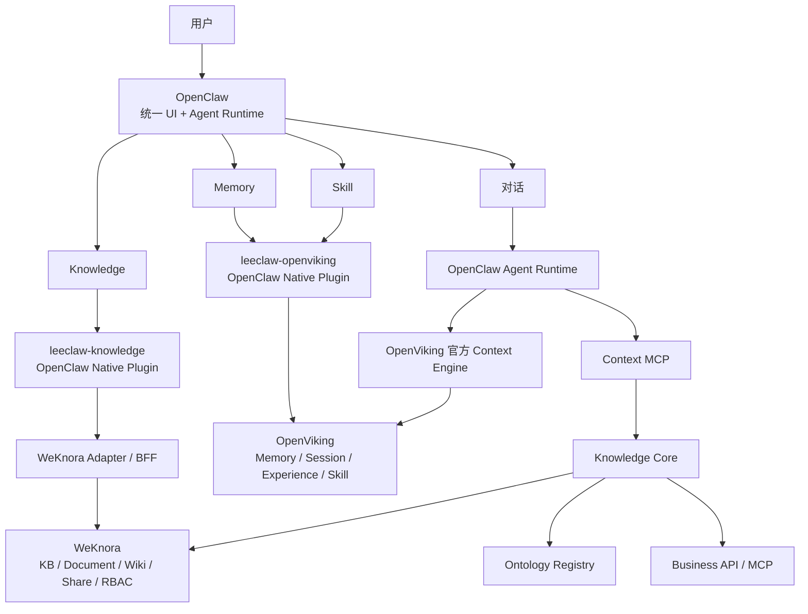
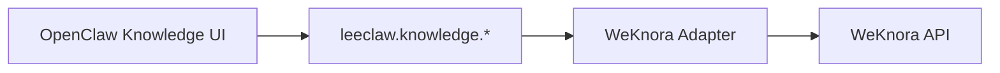
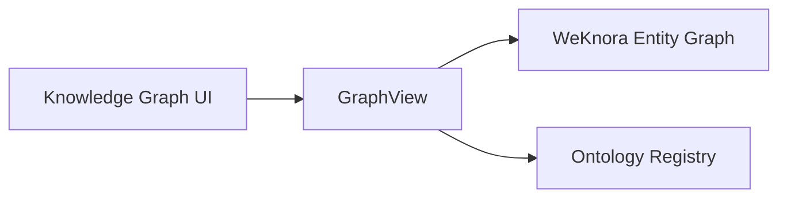
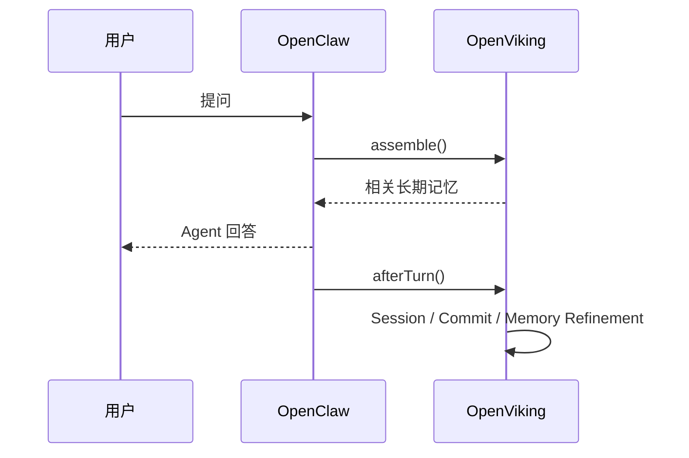
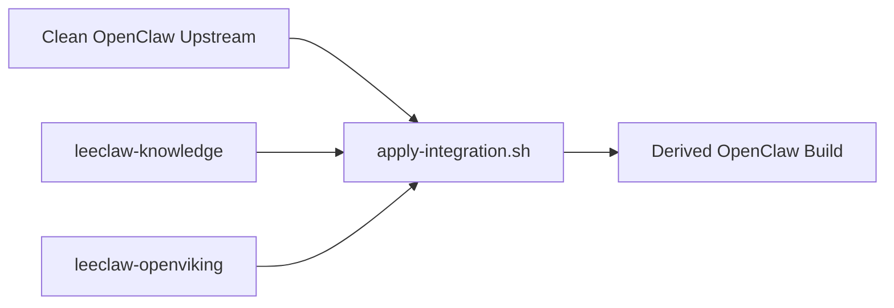

# LeeClaw v0.5

> **OpenClaw Agent Runtime + WeKnora Knowledge + OpenViking Memory & Skill**

LeeClaw v0.5 的目标，是把三个成熟上游组合成一个统一 Agent 产品，同时保持每个上游仍可独立升级。

用户最终面对的是 **OpenClaw 主界面**；Knowledge、Memory、Skill 都以 OpenClaw 原生功能进入同一产品。底层则坚持一个原则：**不复制成熟能力，不把三套系统揉成一个不可升级的大 Fork。**

---

## 1. 一张图看懂 v0.5



一句话：

> **OpenClaw 是主干和统一宿主；WeKnora 管企业知识；OpenViking 管记忆和 Skill；自研层只补三者之间缺少的 Adapter、本体和检索治理。**

---

## 2. 为什么这样组合

如果直接修改三套上游，很快会变成：

```text
OpenClaw 改 30 个文件
WeKnora 改 20 个文件
OpenViking 再改 10 个文件
        ↓
任何一方升级都需要大规模手工合并
```

v0.5 改成：

```text
OpenClaw upgrade
   ↓
Plugin Contract Check

WeKnora upgrade
   ↓
WeKnora Adapter Check

OpenViking upgrade
   ↓
OpenViking Adapter Check
```

版本差异被限制在边界层。

---

## 3. Source of Truth

| 资产 | 唯一权威源 |
|---|---|
| Agent Runtime / 对话执行 | **OpenClaw** |
| Knowledge Base / Document / Wiki / FAQ | **WeKnora** |
| Workspace / Member / Sharing / Knowledge 权限 | **WeKnora** |
| Entity Graph | **WeKnora GraphRAG / Neo4j** |
| Ontology | **自研 Ontology Registry** |
| Memory / Session / Experience / Trajectory | **OpenViking** |
| Skill | **OpenViking** |
| 实时业务事实 | **业务 API / MCP** |

任何新功能开发前，先确定它属于哪一个 Source of Truth；不允许出现两个系统同时维护同一份权威资产。

---

## 4. OpenClaw：整个产品主干

OpenClaw 保留：

- Agent Runtime；
- Chat；
- Session；
- Model；
- Tool；
- MCP；
- Plugin Runtime；
- Control UI。

v0.5 **不修改 OpenClaw Agent Loop 和主 UI 路由源码**。

我们使用它官方已经提供的 Feature/Control UI Plugin 能力，把新的功能挂入侧边栏：

```text
OpenClaw
├── 对话
├── Knowledge
├── Memory
└── Skills
```

因此它仍然可以作为标准 OpenClaw 上游持续升级。

---

## 5. Knowledge：把 WeKnora 能力原生集成进 OpenClaw

这里不是 iframe，也不是把 WeKnora Vue 页面复制过来。

v0.5 新增：

```text
integrations/openclaw/knowledge-plugin
```

它是真正的 OpenClaw Control UI Plugin。

### 当前原生页面

```text
Knowledge
├── 知识库列表
├── 新建知识库
└── 知识库详情
    ├── 文档
    ├── Wiki
    ├── 实体图
    ├── 本体图
    ├── 共享与权限
    │   ├── Workspace 成员
    │   └── Knowledge Base 分享关系
    └── 审计
```

### 关键边界



浏览器页面**禁止直接写 WeKnora API**。

所以 WeKnora API 将来变化时，优先只修改：

```text
integrations/openclaw/knowledge-plugin/lib/weknora-client.js
```

而不是修改所有 Knowledge 页面。

---

## 6. WeKnora：从“独立产品页面”变成 Knowledge Engine

WeKnora 仍然完整保留自己的成熟能力：

- Knowledge Base；
- 文档入库；
- Folder / Tag；
- FAQ；
- Wiki；
- RAG；
- GraphRAG；
- Tenant / Workspace；
- Member；
- Invitation；
- Organization / Sharing；
- Audit；
- API Key / API Principal；
- Entity Graph。

LeeClaw 不复制这些业务规则。

OpenClaw 中的“成员”“共享”“隔离”是 WeKnora 能力的原生产品化呈现，最终权限裁决仍然由 WeKnora 后端完成。

---

## 7. 本体图仍然在 Knowledge 下面

v0.4 已完成的 Ontology Registry 继续保留：

```text
Candidate
  ↓
Approved
  ↓
Immutable Version
  ↓
Published
  ↓
active / pinned
  ↓
Knowledge Base Binding
```

产品上：

```text
Knowledge
└── 图谱
    ├── 实体图
    └── 本体图
```

底层：



**UI 统一，生命周期不合并。**

实体图仍是 WeKnora 事实运行资产；本体仍是自研治理资产。

---

## 8. Memory：直接使用 OpenViking 的真正能力

OpenViking 官方已经提供 OpenClaw context-engine 插件，因此 v0.5 不重新实现 Memory Runtime。



推荐：

```text
recallTargetTypes = user + agent
enableAddResourceTool = false
```

企业 Knowledge 不再复制到 OpenViking Resources。

---

## 9. Skill：权威资产放在 OpenViking

OpenViking 已经有完整 Skills API：

```text
GET  /api/v1/skills
POST /api/v1/skills/find
GET  /api/v1/skills/{skill_name}
```

并支持：

```text
viking://user/{user_id}/skills
viking://agent/skills
```

因此 v0.5 明确：

> **Skill Source of Truth = OpenViking。**

OpenClaw 负责发现、加载、执行；不再建立第二套正式 Skill Store。

Agent 运行时可直接利用 OpenViking 官方插件的：

```text
ov_search
ov_read
ov_multi_read
```

按需加载 Skill，而不是启动时把所有 Skill 全量塞入 Context。

---

## 10. Memory / Skills 也成为 OpenClaw 原生页面

v0.5 新增：

```text
integrations/openclaw/openviking-plugin
```

提供：

```text
Memory
├── 最近 Session
└── 长期 Memory 检索

Skills
├── 全部 Skill
├── 语义查找
└── SKILL.md 查看
```

这个插件只负责 UI 和 Adapter。

真正的 `assemble / afterTurn / compact` 继续由 **OpenViking 官方插件**负责。

---

## 11. Knowledge 管理面与 Agent 检索面必须分开

这是 v0.5 的重要设计原则。

### 人管理知识

```text
Human
  ↓
OpenClaw Knowledge UI
  ↓
Knowledge Adapter
  ↓
WeKnora Management API
```

### Agent 使用知识

```text
Agent
  ↓
Context MCP
  ↓
Semantic Resolver
  ↓
Retrieval Planner
  ↓
Wiki / Entity / Ontology / Business Data
  ↓
Arbiter
  ↓
Context Pack
```

Agent 不直接拿 WeKnora 的几十个 CRUD API 做推理。

---

## 12. 身份、共享与隔离

v0.5 不建立第四套用户库。

Knowledge Adapter 支持 WeKnora：

```text
Authorization
X-API-Key
X-Tenant-ID
X-External-User-ID
```

Graph API 同时支持透传 `X-External-User-Token`。

OpenViking Adapter 使用：

```text
X-OpenViking-Account
X-OpenViking-User
```

推荐映射：

```text
企业 Workspace
    ├─ WeKnora Tenant
    └─ OpenViking Account

当前用户
    ├─ WeKnora External/User Identity
    └─ OpenViking User
```

v0.5 先通过服务端配置完成稳定映射；未来统一 Workspace Switcher 只新增 Runtime Scope Contract，不让三个系统共享数据库主键。

---

## 13. 上游零侵入策略

### OpenClaw

```text
upstream modified files = 0
```

通过外部 Control UI Plugin 接入。

### WeKnora

```text
upstream modified files = 0
```

Knowledge 功能经公开 API 调用。历史 v0.3 GraphExplorer Overlay 保留兼容，但 v0.5 不再扩大 WeKnora Patch 面。

### OpenViking

```text
upstream modified files = 0
```

Memory Runtime 使用官方插件，管理页使用 API Adapter。

---

## 14. 派生构建，而不是长期 Fork



派生目录增加：

```text
extensions/leeclaw-knowledge
extensions/leeclaw-openviking
```

原始 OpenClaw 源码不修改。

---

## 15. 上游版本门禁

当前源码验证基线：

| 上游 | v0.5 验证版本 |
|---|---|
| OpenClaw | `2026.9.3` |
| WeKnora | `0.8.0` |
| OpenViking OpenClaw Plugin | `2026.6.18` |

执行：

```bash
./cobra-knowledge/scripts/check-v0.5-upstreams.sh \
  /path/to/openclaw \
  /path/to/weknora \
  /path/to/openviking
```

每次上游升级必须先检查：

- OpenClaw Plugin / Control UI Contract；
- WeKnora Knowledge / RBAC / Share API；
- OpenViking Context Engine / Session / Search / Skill API。

---

## 16. 本地发布门禁

```bash
cd cobra-knowledge
make verify
```

覆盖：

```text
Go unit tests
Go vet
Go binaries build
JavaScript syntax
WeKnora Adapter contract tests
OpenViking Adapter contract tests
Browser -> Upstream direct API leakage check
```

---

## 17. v0.5 当前实现范围

v0.5 优先把**组合骨架**做正确。

已经完成原生 Knowledge/Memory/Skills 页面和核心 Adapter；WeKnora 更高级的：

- 文件流式上传；
- Chunk 编辑；
- FAQ 全套；
- Datasource；
- Invitation 写操作；
- Member role 写操作；
- Share 写操作；

后续继续沿同一个 Knowledge Contract 扩展即可，不需要重新改变架构。

Memory -> Knowledge 自动回流也不在 v0.5 直接开启：OpenViking 精炼出的 Memory/Experience 先作为 Candidate，后续经过 Evidence、Ontology Mapping、Dedup、Conflict Gate 后才能晋升为企业知识。

---

## 18. 工程目录

```text
repo/
├── cobra-knowledge/
│   ├── internal/                    # Knowledge Core
│   ├── cmd/
│   ├── integrations/
│   │   ├── openclaw/
│   │   │   ├── knowledge-plugin/
│   │   │   ├── openviking-plugin/
│   │   │   └── apply-integration.sh
│   │   ├── openviking/
│   │   └── weknora/
│   ├── compatibility/
│   ├── configs/
│   ├── scripts/
│   └── docs/
└── upstream/                        # 仅记录/参照，不作为自研代码落点
```

---

## 19. 后续开发原则

后续任何功能都先问四个问题：

1. **这个资产的 Source of Truth 是谁？**
2. **上游是否已经有公开 Plugin/API 可以完成？**
3. **差异能否只留在 Adapter？**
4. **上游升级后能否通过 Contract Test 立即发现破坏？**

只要这四个问题回答清楚，LeeClaw 就能持续吸收三个开源项目的能力，而不会被任何一个上游版本锁死。

---

## 20. 当前版本

```text
LeeClaw integration: v0.5.0
Knowledge Core directory: cobra-knowledge (legacy name retained for upgrade safety)
```

详细实现见：

- `cobra-knowledge/ARCHITECTURE.md`
- `cobra-knowledge/docs/V0.5_INTEGRATION.md`
- `cobra-knowledge/RELEASE-v0.5.md`
