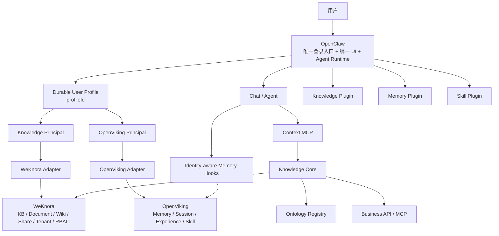

# LeeClaw v0.6

> **OpenClaw Agent Runtime + WeKnora Knowledge + OpenViking Memory & Skill**

LeeClaw 把三个成熟上游组合成一个统一 Agent 产品，同时把耦合限制在 Plugin / Adapter / Contract 边界。v0.6 在 v0.5 组合骨架上完成最重要的一次收口：**OpenClaw durable User Profile 成为唯一的人类账号与认证身份**。

用户只登录 OpenClaw。WeKnora 不再接收用户 Bearer 身份，OpenViking 不再配置静态用户；两者只接收由 OpenClaw 服务端生成的可信 Principal，并继续负责各自资源边界内的授权与隔离。

## 1. 总体架构



一句话：

> **OpenClaw 决定“这个人是谁”；WeKnora 决定知识资源边界；OpenViking决定 Memory/Skill 的用户与 Account 隔离；所有下游身份都由 OpenClaw profileId 派生。**

## 2. v0.6 的账号模型

### 唯一用户身份

```text
OpenClaw authenticatedUserProfile.profileId
                  │
                  ▼
          LeeClaw Principal
             /           \
            /             \
 X-External-User-ID   X-OpenViking-User
        WeKnora            OpenViking
```

v0.6 不再接受以下旧路径：

- 浏览器传 `externalUserId` / `userId`；
- 浏览器传 `tenantId` / `accountId` 去切换下游作用域；
- Knowledge Plugin 使用 WeKnora 用户 Bearer Token；
- OpenViking Plugin 配置静态 `userId/accountId`；
- 多用户环境使用 OpenViking 官方静态用户 context-engine 配置。

Gateway Method 使用 `profileAccess: required`；没有 durable OpenClaw Profile 时，Knowledge / Memory / Skill 管理请求直接拒绝。

## 3. Workspace 映射

v0.6 先采用**服务端绑定的 Workspace**，浏览器没有权力声明下游 Tenant/Account：

```text
LEECLAW_WORKSPACE_ID
      ├─> OpenViking Account
      └─> logical workspace

WEKNORA_TENANT_ID
      └─> WeKnora Tenant
```

这两个映射只存在于服务端配置。未来增加多 Workspace 切换时，也必须先经过服务端 Workspace Resolver 与成员校验，不能重新退回“浏览器直接传 tenant/account”的旧模式。

## 4. Knowledge：OpenClaw 原生体验，WeKnora 后端能力

OpenClaw 中的 Knowledge 页面是原生 Control UI Plugin，不使用 iframe，也不复制 WeKnora 前端。

```text
OpenClaw Knowledge UI
        ↓
leeclaw.knowledge.*
        ↓
Knowledge Adapter / BFF
        ↓
WeKnora API
```

当前覆盖：知识库、文档、Wiki、实体图/本体图、成员、共享、审计等核心管理能力。WeKnora API 路径、服务凭证和 Principal 只存在于服务端 Adapter；browser 代码禁止直接访问上游 API。

Knowledge 请求固定使用：

```text
X-API-Key            = WeKnora 服务凭证
X-Tenant-ID          = 服务端 weknoraTenantId
X-External-User-ID   = OpenClaw profileId
```

不再转发用户 `Authorization: Bearer ...`。Graph API 的 WeKnora 授权检查同样只接受这组服务端 Principal 头。

> WeKnora 的 API Key capability / knowledge_base_ids 仍是最终的知识服务授权边界。v0.6 的用户身份归 OpenClaw，资源级安全校验仍留在 Knowledge Engine，而不是只靠前端隐藏按钮。

## 5. 本体图仍属于 Knowledge

产品结构保持：

```text
Knowledge
├─ 文档 / Wiki / RAG      → WeKnora
├─ 实体图                 → WeKnora GraphRAG / Neo4j
└─ 本体图                 → Ontology Registry
```

实体图与本体图统一投影成稳定 `GraphView`，但底层生命周期继续解耦：实体图是事实图，本体是带版本、发布、active/pinned、回滚和审计的治理资产。

## 6. Memory：OpenViking，身份来自 OpenClaw Session Owner

v0.5 的静态 OpenViking `accountId/userId` 对多用户不安全。v0.6 用 OpenClaw 官方 Session Runtime API 读取：

```text
SessionEntry.createdActor
  type   = human
  source = profile
  id     = <OpenClaw profileId>
```

再生成：

```text
X-OpenViking-Account = LEECLAW_WORKSPACE_ID
X-OpenViking-User    = OpenClaw profileId
```

Memory Runtime 通过 OpenClaw 官方 hooks 接入，不改 Agent Loop：

```text
before_prompt_build
    ↓
按当前 session owner 查询 OpenViking Memory
    ↓
注入“非企业事实、非执行指令”的 Memory Context

agent_end
    ↓
把最新 user/assistant turn 写入同一用户 OpenViking Session
    ↓
达到 pending token 阈值后 commit / 精炼 Memory

before_reset
    ↓
提交尚未精炼的 pending memory
```

这种方式保留 OpenClaw 自己的 Context/Compaction 机制，不需要把 OpenViking 的静态 context-engine 设成唯一槽位，也避免不同 OpenClaw 用户共享同一 Memory 身份。

## 7. Skill：OpenViking 是唯一权威源

```text
OpenClaw User Profile
        ↓
OpenViking trusted principal
        ↓
Skill list / find / read
```

Skill 不同步成第二份正式 OpenClaw 本地资产。OpenClaw 负责发现和执行，OpenViking 负责 Skill 存储、搜索以及后续 Experience → Skill 演进。

## 8. Source of Truth

| 资产 | Source of Truth |
|---|---|
| 人类账号 / 登录 / durable profile | **OpenClaw** |
| Agent Runtime / Chat / Tool / MCP | **OpenClaw** |
| Knowledge Base / Document / Wiki / FAQ | **WeKnora** |
| Knowledge Tenant / API capability / KB scope | **WeKnora** |
| Entity Graph | **WeKnora GraphRAG / Neo4j** |
| Ontology | **LeeClaw Ontology Registry** |
| Memory / Session / Experience / Trajectory | **OpenViking** |
| Skill | **OpenViking** |
| 实时业务事实 | **Business API / MCP** |

## 9. 上游源码与升级

三个上游以 git submodule 分类管理：

```text
upstream/
├─ openclaw/     # v2026.9.3
├─ openviking/   # v0.4.19
└─ weknora/      # v0.8.0
```

完整克隆：

```bash
git clone --recurse-submodules https://github.com/superbuzzy/Weknora-Semantica.git
```

LeeClaw 功能代码不写进 submodule。升级流程固定为：

```text
移动上游版本指针
    ↓
Compatibility Contract
    ↓
Adapter Contract Test
    ↓
OpenClaw derived build / E2E
    ↓
只在 Plugin / Adapter 边界吸收差异
```

## 10. v0.6 四条开发铁律

1. **OpenClaw profileId 是唯一用户 ID。** 下游 user id 不得由浏览器或静态配置覆盖。
2. **浏览器只调用 LeeClaw Gateway Contract。** 不直接认识 WeKnora/OpenViking URL、Token、Tenant、Account。
3. **每类资产只有一个 Source of Truth。** 不通过“同步一份副本”制造双主。
4. **上游差异止于边界层。** 能用 Plugin/API/Hook 实现的能力绝不改上游内核。

## 11. 验证

```bash
cd cobra-knowledge
./scripts/verify-v0.6.sh

./scripts/check-v0.6-upstreams.sh \
  ../upstream/openclaw \
  ../upstream/weknora \
  ../upstream/openviking
```

完整设计见：

- `cobra-knowledge/ARCHITECTURE.md`
- `docs/IDENTITY_AND_AUTHORIZATION.md`
- `cobra-knowledge/RELEASE-v0.6.md`
- `upstream/README.md`
