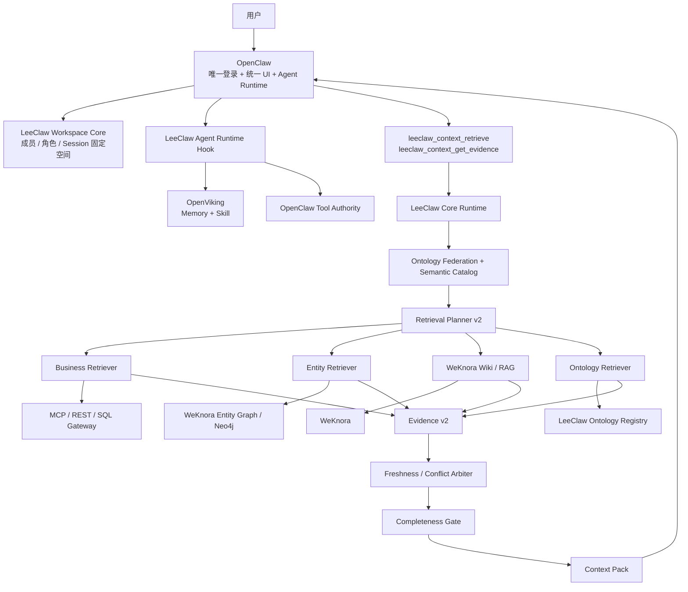

# LeeClaw v0.9

> **OpenClaw Agent Runtime + WeKnora Knowledge + OpenViking Memory & Skill + Retrieval Governance**

LeeClaw 以 OpenClaw 为唯一产品主干和 Agent Runtime，把 WeKnora 的企业知识能力、OpenViking 的长期记忆与 Skill 能力接入同一个运行时。自研代码只补三者之间缺失的 Workspace、Ontology、Retrieval、Context、Adapter 和跨系统治理，不修改三个 upstream 内核。

v0.9 的主题是：**让 Agent 不只“能查”，还要“查对、裁对、知道是否查完整”。**

v0.8 已完成 Skill Runtime + Knowledge Runtime；v0.9 在此基础上补齐 Retrieval Governance：Planner v2、Entity Retriever、Business Retriever Contract、多 KB 本体联合、Evidence Contract v2、冲突/时效裁决和 Completeness Gate。

---

## 1. 总体架构



核心边界：

- **OpenClaw**：唯一人类账号、UI、Agent Runtime、最终 Tool Authority；
- **WeKnora**：企业文档、KB、Wiki、FAQ、RAG、Entity Graph；
- **OpenViking**：Memory、Session、Experience、Skill Source of Truth；
- **LeeClaw**：Workspace、Ontology、Retrieval、Arbitration、Context、Adapter、Governance。

---

## 2. v0.9 Retrieval Governance

一次 Knowledge Runtime 请求现在按以下链路执行：

```text
User Query
  ↓
OpenClaw profileId + Session Workspace
  ↓
Workspace KB Scope
  ↓
KB Ontology Binding
  ↓
Request-scoped Ontology Federation
  ↓
Semantic Catalog
  ↓
Retrieval Planner v2
  ↓
required sources + supporting sources
  ↓
Business / Entity / Wiki-RAG / Ontology Retriever
  ↓
Evidence Contract v2
  ↓
Freshness / Conflict Arbiter
  ↓
Completeness Gate
  ↓
Context Pack
```

Planner 只负责**选择来源和生成受约束执行计划**；Retriever 只负责**访问具体来源并标准化返回结果**。业务系统 URL、SQL、认证方式不得写进 Planner 或 Core 业务逻辑。

---

## 3. Planner v2

Planner v2 的核心输出包括：

```text
intent
required_sources
supporting_sources
freshness_requirement
ontology_scope
allow_fallback
blocking_issues
steps[]
```

每个 Step 明确：

```text
source
operation
required
freshness_requirement
target_class_ids
target_property_ids
target_relation_ids
target_terms
```

典型规则：

- 定义/解释：正式 Wiki/RAG 为 required，本体可作为 supporting；
- 结构化实体事实：Entity Graph 为 required；
- 当前/实时业务指标：Business Data 为 required，freshness=live；
- 本体、Domain/Range、合法关系：Ontology Graph 为 required；
- 诊断类问题：必要事实来源 + supporting 文档证据并行执行。

复杂问题仍可进入 `ComplexPlanRefiner`，但 Refiner 只能重写受约束 Plan，不能绕过 Tool Authority 或直接访问数据源。

---

## 4. Entity Retriever

v0.9 把 Entity Graph 从“可展示”升级为 Runtime Retriever。

```text
Planner
  → EntityQuerySource
  → WeKnora Neo4j Adapter
  → 实体定位 / 属性读取 / 关系路径
  → Evidence v2
```

Entity Retriever 与 UI 共用稳定 `GraphView` 数据合同，不依赖 Neo4j 原始记录结构。Neo4j 查询逻辑留在 Adapter 层，因此后续 WeKnora 图存储变化时只替换 Adapter。

实体结果保留 `knowledge_base_id / knowledge_id / entity_id / chunk_id` 等来源信息，可继续使用 `leeclaw_context_get_evidence` 回溯原始文档证据。

---

## 5. Business Retriever Contract

实时业务数据通过独立合同接入：

```text
BusinessQuerySource
  ↓
MCP / REST / SQL Gateway Adapter
```

当前提供一个通用 HTTP Gateway Adapter：

```text
POST {LEECLAW_BUSINESS_GATEWAY_URL}/v1/query
Authorization: Bearer ${LEECLAW_BUSINESS_GATEWAY_TOKEN}   # optional
```

请求只包含业务语义和服务端已经确认的 Workspace Scope；返回统一 `Assertion[] + Gaps[]`。具体系统 URL、SQL、数据库连接、MCP Tool 名称均不进入 LeeClaw Core。

如果 Planner 判定 Business Data 是 required，而网关未配置、调用失败或没有可用事实，`complete` 必须保持 `false`。

---

## 6. 多 Knowledge Base 本体联合

v0.9 不再要求请求只能绑定一个 KB 本体。

多个 KB 会按当前请求范围进行：

```text
KB Binding
  → namespace
  → Semantic Catalog 编译
  → concept id / label 对齐
  → conflict detection
  → request-scoped federated catalog
```

联合规则采用保守策略：

- 相同 concept ID + 相同 label：合并 alias 和 preferred source；
- 相同 label + 不同 concept ID：保留 concept-sense conflict；
- 相同 concept ID + 不同 label：保留冲突；
- 冲突与当前 query 相关时进入 `blocking_issues`，不得静默 merge 后继续声称完整。

本体生命周期仍归 LeeClaw Ontology Registry，实体图生命周期仍归 WeKnora，两者只在请求期联合，不建立第二份可写主数据。

---

## 7. Evidence Contract v2

所有 Retriever 逐步统一到以下证据合同：

```text
source
source_type
source_id
knowledge_base_id
knowledge_id
entity_id
chunk_id
value
unit
version
effective_time
observed_at
valid_from / valid_to
confidence
quality
provenance
metadata
```

Evidence v2 保留 v0.8 已有字段，避免破坏 WeKnora Chunk/Graph 集成，同时补齐跨来源裁决需要的来源类型、事实值、时效和 provenance。

---

## 8. Arbitration 与 Completeness Gate

Arbiter 继续按事实槽位进行冲突裁决：

```text
有效时间
+ Source Authority
+ Predicate Source Priority
+ Confidence
+ Freshness
+ Supersedes
```

无法形成决定性优势时返回 `unresolved_conflict`，不静默选择一个值。

v0.9 的 `complete=true` 以 required source 为核心判断依据。Context Pack 新增：

```text
source_status[]
blocking_gaps[]
gaps[]
complete
```

规则：

- required source 未满足 → blocking gap → `complete=false`；
- unresolved conflict → blocking gap → `complete=false`；
- 相关本体联合冲突 → blocking gap → `complete=false`；
- supporting source 失败只保留普通 Gap，不会单独把一个已经完整的必要事实判成 incomplete；
- RAG fallback 可以补解释性证据，但不能替代缺失的实时/结构化 required source。

---

## 9. Workspace、身份与权限

唯一人类身份保持不变：

```text
OpenClaw authenticatedUserProfile.profileId
```

Agent Session 第一次运行时绑定 Workspace，后续页面切换默认 Workspace 不会改变既有 Session Scope。失去 membership 后既有 Session fail closed。

下游身份由服务端映射：

```text
WeKnora:
  X-API-Key          = Workspace service credential
  X-Tenant-ID        = Workspace tenant
  X-External-User-ID = OpenClaw profileId

OpenViking:
  X-OpenViking-Account = Session Workspace Account
  X-OpenViking-User    = OpenClaw profileId
```

浏览器不能提供这些可信字段。

Skill 的 `allowed-tools` 仍只能收窄 OpenClaw Tool Authority，不能扩权。

---

## 10. Source of Truth

| 资产 | Source of Truth |
|---|---|
| 人类账号 / Profile | OpenClaw |
| Agent Runtime / Tool Authority | OpenClaw |
| Workspace Membership / Role / Session Binding | LeeClaw Workspace Core |
| KB / 文档 / Wiki / FAQ / RAG | WeKnora |
| Entity Graph | WeKnora |
| Ontology / Binding / Version | LeeClaw Ontology Registry |
| Memory / Session / Experience / Skill | OpenViking |
| 实时业务事实 | 业务 API / MCP / 数据网关 |

任何新功能开发前必须先确定唯一 Source of Truth。

---

## 11. 代码结构

```text
cobra-knowledge/
├─ integrations/openclaw/
│  ├─ workspace-core/
│  ├─ knowledge-plugin/
│  └─ openviking-plugin/
├─ internal/
│  ├─ runtimecontext/
│  ├─ retrieval/
│  ├─ context/
│  ├─ ontology/
│  ├─ graphview/
│  └─ adapters/
│     ├─ weknora/
│     └─ business/
├─ configs/
├─ compatibility/
└─ scripts/

upstream/
├─ openclaw/
├─ openviking/
└─ weknora/
```

三个 `upstream/` 保持独立 submodule，LeeClaw 功能代码不得写入上游目录。

---

## 12. 当前上游兼容基线

```text
OpenClaw   v2026.9.3
WeKnora    v0.8.0
OpenViking v0.4.19
```

升级顺序：

```text
移动 upstream commit
  → Upstream Contract Gate
  → Adapter / Runtime Contract Test
  → Derived OpenClaw Assembly
  → Full Build / E2E
  → 只在 Plugin / Adapter 边界吸收差异
```

必须继续保持：

```text
OpenClaw upstream modified files: 0
WeKnora upstream modified files: 0
OpenViking upstream modified files: 0
```

---

## 13. 配置与验证

活跃配置：

```text
cobra-knowledge/configs/openclaw-v0.9.example.json
cobra-knowledge/configs/workspaces-v0.9.example.json
```

本地验证：

```bash
cd cobra-knowledge
./scripts/verify-v0.9.sh
```

上游契约：

```bash
./scripts/check-v0.9-upstreams.sh \
  ../upstream/openclaw \
  ../upstream/weknora \
  ../upstream/openviking
```

业务数据 Retriever 为可选装配；需要实时问数时配置：

```text
LEECLAW_BUSINESS_GATEWAY_URL
LEECLAW_BUSINESS_GATEWAY_TOKEN   # optional
```

---

## 14. v0.9 当前边界

v0.9 已完成 Retrieval Governance 的核心运行链，但生产化边界仍保持清晰：

- Business Retriever 已有稳定接口与通用 HTTP Adapter，具体 MCP/SQL Gateway 由业务系统侧实现；
- Entity Retriever 当前通过 WeKnora Neo4j 读取，不修改 WeKnora 内核；
- 多 KB 联合当前聚焦 Semantic Catalog 与 concept-sense conflict，不做跨本体自动推理；
- Planner v2 仍以确定性语义规则为主，复杂问题可以挂接受约束 Refiner；
- Workspace Registry / Session State / Audit / Ontology FSRegistry 仍是单实例文件存储基线；
- Memory → Knowledge、Experience → Skill Promotion 留到 v0.10；
- 多实例、共享状态、限流/预算/熔断等生产能力留到 v0.11；
- Trace / Eval / CI / 自动回归发布留到 v0.12。

版本演进继续遵循：**先把运行边界和正确性做实，再增加自动学习与生产规模能力。**
