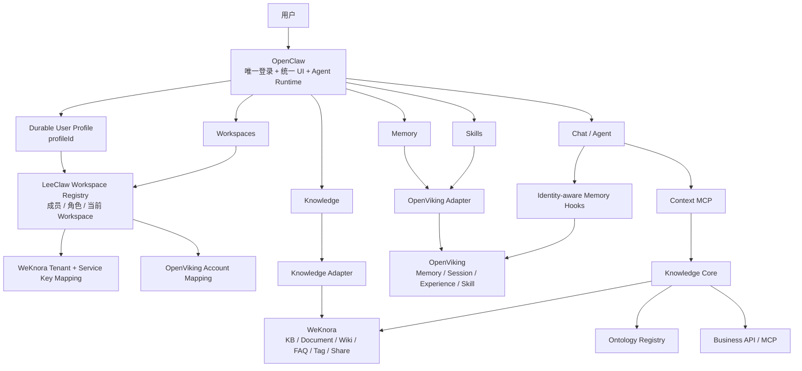

# LeeClaw v0.7

> **OpenClaw Agent Runtime + WeKnora Knowledge + OpenViking Memory & Skill**

LeeClaw 将三个成熟上游组合为一个统一 Agent 产品。OpenClaw 是唯一产品主干、唯一人类账号入口和 Agent Runtime；WeKnora 提供企业 Knowledge Engine；OpenViking 提供 Memory 与 Skill Engine；LeeClaw 自研层只负责 Workspace、适配、知识治理和必要的企业级边界。

v0.7 的主题是：**从“单账号、单 Workspace 骨架”进入“多人、多 Workspace、完整 Knowledge 管理”。**

---

## 1. v0.7 一张图



核心原则：

> **OpenClaw 决定“这个人是谁”；LeeClaw Workspace Registry 决定“这个人在当前空间能做什么以及下游映射到哪里”；WeKnora 和 OpenViking只负责各自资源引擎。**

---

## 2. v0.7 解决了什么

### 多 Workspace 真正落地

v0.6 的 `workspaceId / weknoraTenantId` 是静态服务配置。v0.7 已直接替换为服务端 Workspace Registry：

```text
OpenClaw profileId
      ↓
Workspace membership
      ↓
viewer / editor / admin / owner
      ↓
validated workspace
      ├─> WeKnora tenant + service credential
      └─> OpenViking account
```

浏览器可以请求“切换到某个逻辑 Workspace”，但它不能声明 `tenantId`、`accountId`、API Key 或下游 user id。服务端每次重新校验 membership 后才解析下游作用域。

Workspace 切换对 Knowledge、Memory、Skill 和 Chat Memory 同时生效。

### OpenClaw Profile 是唯一人类账号

LeeClaw 仍坚持：

```text
OpenClaw authenticatedUserProfile.profileId
                  ↓
            global user id
```

WeKnora 不要求 LeeClaw 用户维护第二套账号，OpenViking 也不维护第二套人类登录。Workspace 成员直接绑定 OpenClaw Profile ID。

### Knowledge 管理从 MVP 进入完整工作区

OpenClaw 原生 Knowledge 页面当前提供：

```text
Knowledge
├─ Knowledge Base
│  ├─ 创建 / 修改 / 删除
│  └─ 文档型 / FAQ 型
├─ Documents
│  ├─ 文件上传
│  ├─ URL 入库
│  ├─ 手工知识
│  ├─ 解析状态
│  ├─ 重解析 / 取消解析
│  └─ 删除
├─ Wiki
│  ├─ 列表
│  ├─ 创建 / 编辑
│  └─ 删除
├─ FAQ
│  ├─ 列表
│  ├─ 创建 / 编辑
│  └─ 删除
├─ Tags
│  ├─ 列表
│  ├─ 创建 / 编辑
│  └─ 删除
├─ 检索测试
├─ 图谱
│  ├─ 实体图
│  └─ 本体图
├─ 共享
│  ├─ 查看组织共享
│  ├─ 新增共享
│  ├─ 修改权限
│  └─ 取消共享
├─ 审计
└─ 设置
```

这些都是 OpenClaw 原生 Control UI，不使用 iframe，也不复制 WeKnora 前端。浏览器只调用 `leeclaw.*` Gateway Contract，WeKnora URL、Tenant 和 Credential 只存在于服务端 Adapter。

---

## 3. 权限模型

v0.7 明确把“人类账号”和“资源引擎”拆开。

| 层级 | 权威来源 | 负责内容 |
|---|---|---|
| 人类账号 / 登录 / Profile | **OpenClaw** | 唯一人类身份 |
| 平台 Scope | **OpenClaw** | `operator.read/write/admin`、插件和平台操作 |
| Workspace Membership / Role | **LeeClaw Workspace Registry** | 多空间成员、角色、当前空间、下游映射 |
| Knowledge Engine Tenant / API Capability | **WeKnora** | 服务凭证能力、Tenant 边界、知识资源实现 |
| Memory / Skill 隔离 | **OpenViking** | `Account=workspace`、`User=profileId` |
| Ontology 生命周期 | **LeeClaw Ontology Registry** | 版本、发布、active/pinned、回滚、Binding |

Workspace Role：

```text
viewer  → 读取 Knowledge / Memory / Skill
editor  → viewer + KB 内容编辑、文档/Wiki/FAQ/Tag 写入
admin   → editor + KB 删除、共享管理等高风险 Knowledge 动作
owner   → admin + Workspace 成员与角色管理
```

平台 Scope 和 Workspace Role 两道门同时生效。例如共享写操作同时需要 OpenClaw `operator.admin` 和 Workspace `admin/owner`。

### 为什么 v0.7 不再把 WeKnora 成员表当 LeeClaw 用户表

WeKnora 的 API Principal 能稳定提供 Tenant、Capability 和 External Principal，但共享 service key 下的 `X-External-User-ID` 并不等价于 OpenClaw 多用户的完整 RBAC。v0.7 因此直接修正：**用户级授权由 OpenClaw Profile + LeeClaw Workspace Role 裁决；WeKnora 不再承担 LeeClaw 人类账号管理。**

这避免为了复用知识引擎又建立第二套登录账号。

---

## 4. Workspace Registry

配置示例：

```json
{
  "version": 1,
  "workspaces": [
    {
      "id": "workspace-chongqing",
      "name": "重庆公司",
      "members": [
        { "profileId": "profile-owner", "role": "owner" },
        { "profileId": "profile-editor", "role": "editor" }
      ],
      "weknora": {
        "tenantId": "42",
        "apiKeyEnv": "WEKNORA_API_KEY_CHONGQING"
      },
      "openviking": {
        "accountId": "workspace-chongqing"
      }
    }
  ]
}
```

关键约束：

- Registry 文件只记录 API Key 的环境变量名，不存 Key 明文；
- OpenViking 不读取、不依赖 WeKnora API Key；
- 当前选择状态服务端持久化，浏览器没有权力直接改下游映射；
- owner 不能删除或降级最后一个 owner；
- 成员页面读取 OpenClaw `users.list`，成员映射只保存 `profileId`。

> v0.7 的 Workspace Registry / selection state 是**单 Gateway 文件基线**。多 Gateway / HA 部署应把相同 Contract 替换为 PostgreSQL 等共享存储，不应通过共享文件目录模拟分布式一致性。

---

## 5. Knowledge Adapter

所有 Knowledge 请求固定经过：

```text
OpenClaw Knowledge UI
        ↓
leeclaw.knowledge.*
        ↓
Durable Profile + Workspace Resolver + Role Gate
        ↓
WeKnora Adapter
        ↓
WeKnora API
```

Adapter 在服务端生成：

```text
X-API-Key          = 当前 Workspace 对应的 service key
X-Tenant-ID        = 当前 Workspace 对应的 WeKnora tenant
X-External-User-ID = OpenClaw profileId
```

浏览器不接触这些 Header。

WeKnora API 将来变化时，优先只调整：

```text
integrations/openclaw/knowledge-plugin/lib/weknora-client.js
```

不让变化扩散到 OpenClaw Agent Runtime 或 Knowledge UI。

---

## 6. 审计

WeKnora 的 KB Activity 路由是 JWT owner/admin surface，不适用于 LeeClaw 当前“OpenClaw 单账号 + WeKnora Service Principal”链路。v0.7 已删除这条不可达的旧调用，直接替换为 LeeClaw 服务端审计：

```text
OpenClaw profileId
+ Workspace
+ action
+ resource type/id
+ outcome
+ time
```

审计不会落文件正文、base64、Token 等敏感请求载荷。当前审计同 Workspace Registry 一样是单 Gateway 文件实现；后续多实例部署应替换为数据库/集中审计后端。

---

## 7. Memory 与 Skill

OpenViking 继续是唯一 Source of Truth：

```text
Memory / Session / Experience / Trajectory → OpenViking
Skill                                      → OpenViking
```

当前 Workspace 经过服务端解析为：

```text
X-OpenViking-Account = workspace.openviking.accountId
X-OpenViking-User    = OpenClaw profileId
```

Memory Runtime 继续通过 OpenClaw 官方 hooks 接入：

```text
before_prompt_build → recall
agent_end           → capture + commit
before_reset        → flush pending memory
```

OpenViking Adapter 不需要 WeKnora Credential，两条引擎链彼此独立。

> v0.7 的 Skill 仍完成“存储 / 列表 / 语义查找 / 读取”。Skill Resolver → 动态加载 → Agent Turn 执行闭环属于下一阶段 Runtime 工作，不在 v0.7 虚假宣称完成。

---

## 8. 本体图继续属于 Knowledge

```text
Knowledge
├─ 文档 / Wiki / FAQ / RAG    → WeKnora
├─ 实体图                     → WeKnora GraphRAG / Neo4j
└─ 本体图                     → LeeClaw Ontology Registry
```

实体图与本体图统一投影为稳定 `GraphView`，但生命周期不合并。

本体仍保持：

```text
Candidate → Immutable Version → Publish → Active / Pinned → KB Binding → Rollback / Audit
```

---

## 9. 上游与低耦合

三个上游固定放在：

```text
upstream/
├─ openclaw/      # v2026.9.3
├─ openviking/    # v0.4.19
└─ weknora/       # v0.8.0
```

完整克隆：

```bash
git clone --recurse-submodules https://github.com/superbuzzy/Weknora-Semantica.git
```

LeeClaw 功能代码不写入 submodule。v0.7 继续要求：

```text
OpenClaw upstream modified files: 0
WeKnora upstream modified files: 0
OpenViking upstream modified files: 0
```

升级顺序固定：

```text
移动 upstream commit
  → Compatibility Contract
  → Adapter Contract Test
  → Derived OpenClaw Assembly
  → E2E
  → 只在 Plugin / Adapter 边界吸收差异
```

---

## 10. 配置与验证

示例：

- `cobra-knowledge/configs/openclaw-v0.7.example.json`
- `cobra-knowledge/configs/workspaces-v0.7.example.json`

验证：

```bash
cd cobra-knowledge
./scripts/verify-v0.7.sh

./scripts/check-v0.7-upstreams.sh \
  ../upstream/openclaw \
  ../upstream/weknora \
  ../upstream/openviking
```

派生 OpenClaw：

```bash
./integrations/openclaw/apply-integration.sh \
  ../upstream/openclaw \
  ../build/openclaw-v0.7
```

---

## 11. 当前真实边界

v0.7 解决的是“企业多人使用的管理面骨架”，没有提前宣称后续能力已经完成：

- Workspace Registry 与 LeeClaw audit 仍是单 Gateway 文件后端；
- Control UI 文件上传经过 JSON RPC base64 转换，默认上限 10 MiB、硬上限 50 MiB；大文件需要后续 authenticated streaming upload route；
- Knowledge 原生页面已覆盖主要管理闭环，但 WeKnora 的高级批处理、Chunk 级编辑、Wiki revision/lint 等仍可继续按 Contract 增量接入；
- Skill Runtime 的自动发现/动态加载/allowed-tools 执行尚未进入 v0.7；
- Memory → Knowledge / Experience → Skill Promotion 尚未进入 v0.7；
- 完整生产 CI、HA Registry、集中审计与全链路 Eval 仍属于生产化阶段。

这些边界都应继续通过 Adapter / Registry Interface 扩展，不回到修改上游内核的路线。
