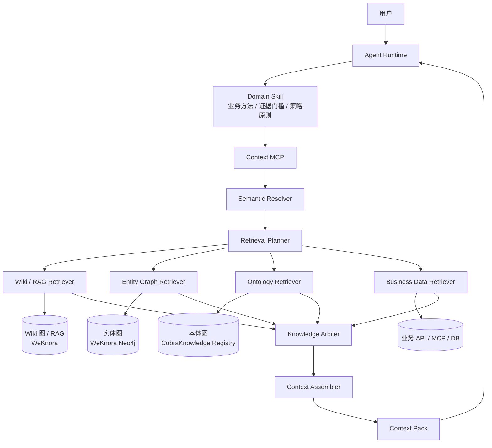
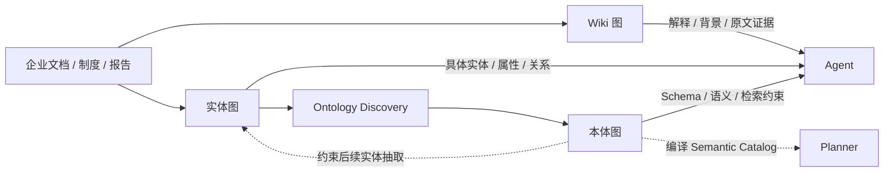
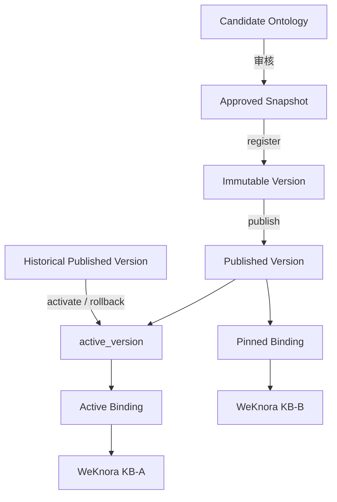
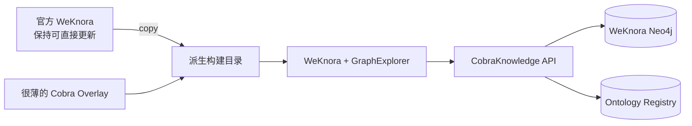
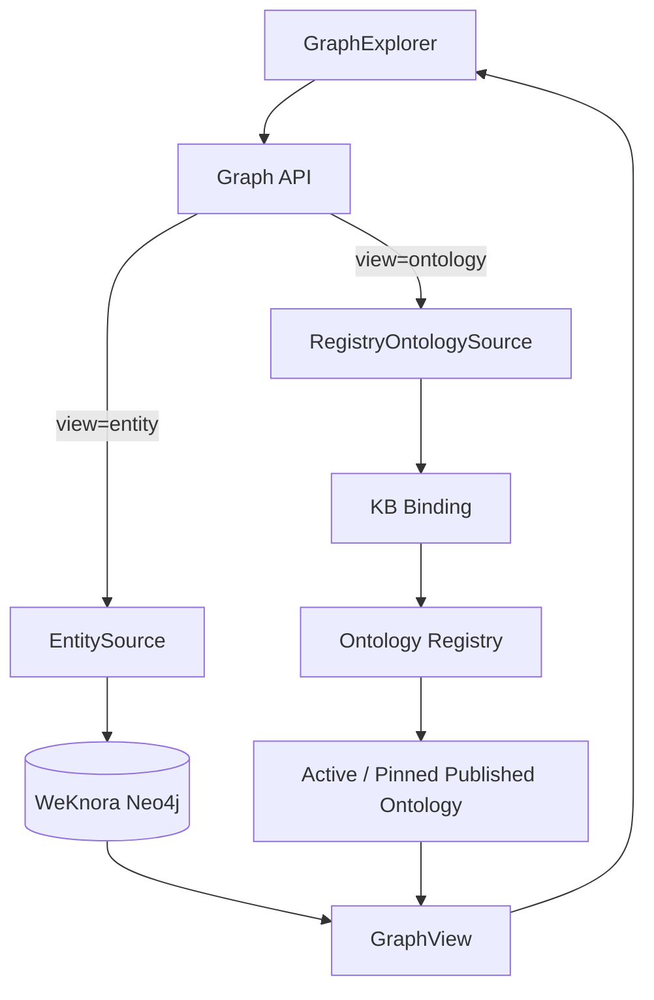
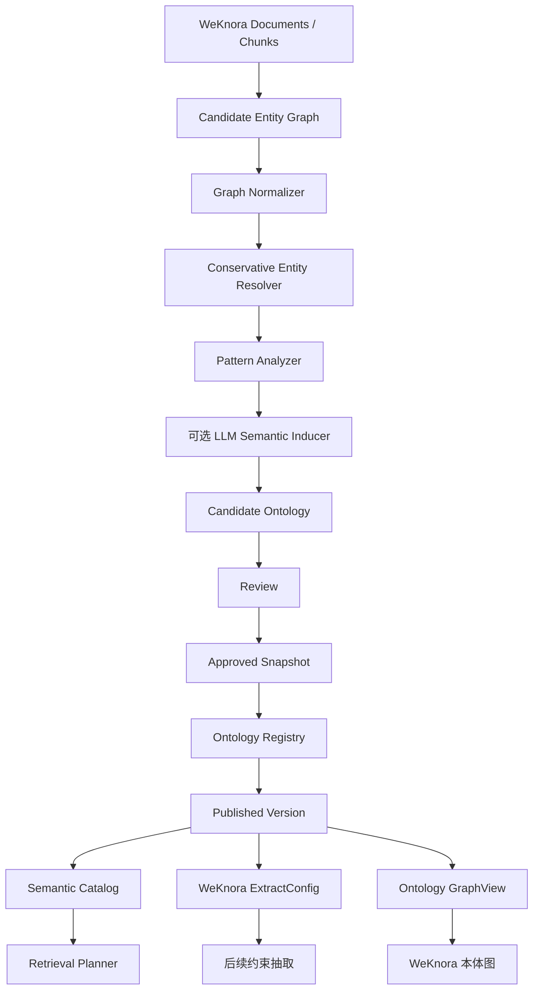

# CobraKnowledge v0.4

> 面向企业 Agent 的检索、知识图谱、本体与上下文治理内核

CobraKnowledge 的目标，是让 Agent 在企业场景中能够**理解业务语义、找到正确知识、判断知识是否可信、处理时效与冲突，并将足够且可追溯的上下文交给大模型推理**。

当前版本：`v0.4.0`

- 核心实现：Go
- WeKnora：文档、Chunk、RAG、Wiki、GraphRAG 实体图等知识底座之一
- Semantica：仅作为 Ontology / Provenance / Conflict / Validation 等方法研究参考
- Agent Runtime：可对接 OpenClaw、Codex Runtime 等
- v0.4 新增：**Ontology Registry、本体版本发布、KB Binding、回滚、审计**
- 运行时不依赖 Semantica；v0.4 不新增 WeKnora 上游侵入

---

## 1. 项目定位

CobraKnowledge 不是单纯的 RAG、知识图谱或本体工具。我们要解决的是企业 Agent 真正上线后最核心的问题：

> **面对多种知识源和业务系统，Agent 该查什么、去哪查、相信谁、什么时候停止，以及最后把什么上下文交给模型。**

因此，CobraKnowledge 的核心能力是 **Retrieval Control Plane（检索控制面）**。



准确检索并不等于“找到最相似的文本”。企业场景需要同时考虑：

- 业务语义；
- 实体和属性；
- 组织与范围；
- 有效时间；
- 来源权威度；
- 数据新鲜度；
- 证据完整性；
- 版本；
- 冲突；
- 停止条件。

---

## 2. 三张图



### Wiki 图

回答“为什么、依据是什么、报告怎么分析、制度怎么描述”。当前主要使用 WeKnora Wiki/RAG。

### 实体图

保存具体业务对象和关系，例如：

```text
宾川县 → 包含 → 金牛变电站 → 供出 → 金牛线 → 供电 → XX台区
```

当前主要使用 WeKnora GraphRAG Neo4j。

### 本体图

定义业务世界的结构：Class、Property、Relation、Hierarchy、Domain/Range、Constraint、SourceBinding、RetrievalPolicy。

例如：

```text
线路
├─ 属性：电压等级
├─ 属性：转供状态
├─ 关系：所属 → 变电站
└─ 关系：供电 → 台区
```

本体同时参与：

- 语义消歧；
- 检索源选择；
- 来源优先级；
- 新鲜度规则；
- 冲突规则；
- 实体图抽取约束；
- 本体图展示。

---

## 3. v0.4：Ontology Registry

v0.3 已经能在 WeKnora 页面显示本体图，但当时本质上还是：

```text
KB -> ontology-bindings.json -> ontology.json
```

v0.4 将它升级为真正的本体资产治理：



### 3.1 本体版本不可变

一旦 `ontology_id + version` 注册：

- 内容不能覆盖；
- Registry 保存 SHA-256；
- 每次读取重新校验；
- 如果文件被外部篡改，直接拒绝加载。

### 3.2 发布状态和本体内容分离

发布、回滚不重写历史本体文件。

```text
versions/1.0.0.json   immutable
versions/1.1.0.json   immutable
manifest.json         active_version / release metadata
```

### 3.3 Active / Pinned 两种 KB Binding

**Active**：知识库自动跟随当前正式版本。

```text
KB-A -> DistributionOntology -> active_version
```

**Pinned**：知识库固定到指定版本。

```text
KB-B -> DistributionOntology@1.0.0
```

Pinned 适用于灰度、评测和生产冻结窗口。

### 3.4 回滚

回滚只移动指针：

```text
active_version = 1.1.0
        ↓
active_version = 1.0.0
```

不删除 1.1.0，也不修改 1.0.0。

### 3.5 审计

以下动作进入 append-only Audit Event：

- register version；
- publish；
- activate / rollback；
- bind knowledge base。

---

## 4. 为什么 v0.4 不严重修改 WeKnora

这是本项目的固定边界。



v0.4 **没有新增** WeKnora Overlay 文件或后端修改：

- 不改 WeKnora Go 后端；
- 不改 GraphRAG 建图；
- 不改 GraphRAG 检索；
- 不改 Neo4j Label/Relation Schema；
- 不增加 WeKnora 数据表；
- 不增加新的 GraphSettings Patch；
- 不修改 v0.3 已有 `GraphExplorer.vue`；
- 不修改 v0.3 已有前端 Cobra API 文件。

WeKnora 页面仍调用完全相同的接口：

```text
GET /api/v1/knowledge-bases/{kb_id}/graph?view=entity
GET /api/v1/knowledge-bases/{kb_id}/graph?view=ontology
```

变化全部发生在 CobraKnowledge 内部：

```text
v0.3: KB -> 文件绑定 -> Ontology JSON
v0.4: KB -> Registry Binding -> active/pinned published version
```

因此 WeKnora 官方升级后，仍只需要维护原先那一个很薄的 Overlay 接入点。

---

## 5. WeKnora 页面上的实体图 / 本体图

```text
知识库图谱区域
┌──────────────┬──────────────┐
│    实体图     │    本体图     │
└──────────────┴──────────────┘
```



前端只认统一：

```text
GraphView
├─ nodes[]
├─ edges[]
└─ meta
```

不理解 Neo4j 内部结构，也不理解 Registry 文件结构。

---

## 6. Skill / MCP / Planner / Arbiter 分工

| 模块 | 负责什么 |
|---|---|
| Skill | 业务方法、判断步骤、证据要求、检索原则 |
| MCP | 向 Agent 暴露稳定能力 |
| Semantic Resolver | 自然语言映射为标准业务语义 |
| Planner | 决定这次查什么、去哪查、并行还是串行、何时停止 |
| Retriever | 实际执行 Wiki / Entity / Ontology / Data 查询 |
| Arbiter | 处理时效、来源、版本和冲突 |
| Context Assembler | 形成最终 Context Pack |
| Runtime | 会话、模型、Skill、工具调用、状态和轨迹 |

一句话：

> **Skill 管方法，Planner 管策略，MCP 管能力，三张图管知识，Arbiter 管可信度，Context Assembler 管上下文，Runtime 管执行。**

---

## 7. 知识冲突和过期

CobraKnowledge 不建议把变化事实直接覆盖在 Entity Property 上，而是抽象为 Assertion：

```text
金牛线
  ├─ Assertion A: 转供状态=不可转供 / 2024报告
  └─ Assertion B: 转供状态=可转供   / 2026业务系统
```

并保留：

```text
source
scope
valid_from / valid_to
observed_at
published_at
evidence
confidence
```

Arbiter 的判断维度包括：

```text
语义相关度
+ 业务范围匹配
+ 时间有效性
+ 来源权威度
+ 证据完整性
+ 数据新鲜度
+ 本体一致性
- 冲突风险
```

真正无法确定的冲突返回：

```text
unresolved_conflict
```

而不是让 LLM 强行选一个答案。

---

## 8. 本体构建闭环



采用：

> **Bottom-up 发现 + Top-down 治理。**

---

## 9. 权限

### 图谱查看

```text
Browser WeKnora Token
        ↓
Cobra Graph API
        ↓ delegate
WeKnora GET /api/v1/knowledge-bases/{kb_id}
```

沿用 WeKnora RBAC。

### 本体治理

Registry 管理接口使用独立：

```text
X-Cobra-Admin-Token
```

普通 WeKnora 用户 Token 不能直接执行本体发布、回滚和 KB Binding。

---

## 10. Registry 存储

v0.4 默认实现 `FSRegistry`：

```text
var/ontology-registry/
├── ontologies/
│   └── <ontology_id>/
│       ├── manifest.json
│       └── versions/
│           ├── 1.0.0.json
│           └── 1.1.0.json
├── bindings/
│   └── <kb_id>.json
└── audit/
    └── events.jsonl
```

这一实现主要用于单写实例。代码已经抽象 `ontology.Registry` 接口，未来换 PostgreSQL 时无需改 WeKnora Overlay、GraphView、Planner 和 MCP 契约。

---

## 11. 快速开始

```bash
cd cobra-knowledge
make test
make vet
make build
```

生成候选本体：

```bash
bin/cobra-knowledge bootstrap \
  -in examples/weknora-graph.json \
  -domain distribution_network \
  -out out/bootstrap
```

审核并生成 approved 快照：

```bash
bin/cobra-knowledge approve-ontology \
  -ontology out/bootstrap/candidate-ontology.json \
  -version 1.0.0 \
  -reviewer reviewer \
  -out out/approved-ontology.json
```

注册：

```bash
bin/cobra-knowledge registry-register \
  -root var/ontology-registry \
  -ontology out/approved-ontology.json \
  -actor reviewer
```

发布：

```bash
bin/cobra-knowledge registry-publish \
  -root var/ontology-registry \
  -ontology-id <ontology_id> \
  -version 1.0.0 \
  -actor publisher
```

绑定知识库：

```bash
bin/cobra-knowledge registry-bind \
  -root var/ontology-registry \
  -kb <weknora_kb_id> \
  -ontology-id <ontology_id> \
  -mode active \
  -actor operator
```

回滚：

```bash
bin/cobra-knowledge registry-activate \
  -root var/ontology-registry \
  -ontology-id <ontology_id> \
  -version 1.0.0 \
  -actor operator
```

---

## 12. CobraKnowledge API

```bash
export COBRA_ONTOLOGY_REGISTRY_ROOT=/app/data/ontology-registry
export COBRA_REGISTRY_ADMIN_TOKEN='replace-with-a-long-random-token'
export COBRA_NEO4J_URL=http://neo4j:7474
export COBRA_NEO4J_USER=neo4j
export COBRA_NEO4J_PASSWORD='***'
export COBRA_WEKNORA_BASE_URL=http://weknora:8080
export COBRA_GRAPH_AUTH_MODE=weknora

bin/cobra-graph-api -listen :8090
```

图谱接口：

```text
GET /api/v1/knowledge-bases/{kb_id}/graph?view=entity&limit=160
GET /api/v1/knowledge-bases/{kb_id}/graph?view=ontology
```

Registry 管理接口：

```text
GET  /api/v1/registry/ontologies
GET  /api/v1/registry/ontologies/{ontology_id}
GET  /api/v1/registry/ontologies/{ontology_id}/versions/{version}
POST /api/v1/registry/ontologies/versions
POST /api/v1/registry/ontologies/{ontology_id}/versions/{version}/publish
POST /api/v1/registry/ontologies/{ontology_id}/activate
GET  /api/v1/registry/knowledge-bases/{kb_id}/binding
PUT  /api/v1/registry/knowledge-bases/{kb_id}/binding
GET  /api/v1/registry/audit?limit=100
```

---

## 13. Context MCP

生产推荐从 Registry 读取正式本体：

```bash
export COBRA_ONTOLOGY_REGISTRY_ROOT=/app/data/ontology-registry
export COBRA_ONTOLOGY_KB_ID=<weknora_kb_id>
export WEKNORA_BASE_URL=http://weknora:8080
export WEKNORA_API_KEY=sk-xxxxx

go run ./cmd/context-mcp
```

Agent 生产主入口仍保持很小：

```text
context.retrieve
context.get_evidence
```

`COBRA_ONTOLOGY_FILE` 仅保留本地开发兼容入口。

---

## 14. 工程目录

```text
Weknora-Semantica/
├── README.md
├── upstream/
│   └── README.md
└── cobra-knowledge/
    ├── cmd/
    │   ├── cobra/
    │   ├── context-mcp/
    │   └── graph-api/
    ├── internal/
    │   ├── ontology/
    │   ├── graph/
    │   ├── graphview/
    │   ├── retrieval/
    │   ├── context/
    │   ├── httpapi/
    │   ├── mcp/
    │   └── access/
    ├── integrations/weknora/
    ├── prompts/
    ├── skills/
    └── docs/
```

---

## 15. 当前验证状态

v0.4 当前已验证：

```text
go test ./...     PASS
go vet ./...      PASS
make build        PASS
```

并完成真实生命周期冒烟：

```text
candidate
  ↓ approve
1.0.0 register
  ↓ publish
KB active -> 1.0.0
  ↓
1.1.0 register + publish
  ↓
KB active -> 1.1.0
  ↓ rollback
KB active -> 1.0.0
```

同时验证：

- 本体版本重复写入被拒绝；
- payload 篡改会触发 checksum mismatch；
- pinned binding 不随 active 版本变化；
- 未发布版本不能被 pinned；
- candidate 未 approved 不能 publish；
- 普通 WeKnora Token 不能访问 Registry 管理 API；
- 本体图接口能解析 Registry 当前正式版本；
- v0.4 没有扩大 WeKnora Overlay 修改范围。

---

## 16. 后续路线

v0.5 优先方向：

1. PostgreSQL Registry，多副本事务化写入；
2. 本体候选审核 UI；
3. 本体 Diff 与影响分析；
4. 发布前自动触发 CobraEval 回归评测；
5. 发布后自动编译 Semantic Catalog / ExtractConfig；
6. 实体图 Assertion/Evidence 增量治理。

---

## 17. 设计原则

1. **不长期 fork WeKnora。**
2. **不污染 Semantica。**
3. **上游能力全部经过 Adapter/Overlay 边界。**
4. **本体是治理资产，不是普通图节点集合。**
5. **历史版本不可覆盖。**
6. **证据和策略分离。**
7. **LLM 负责语义判断，代码负责确定性约束。**
8. **在线检索优先最小充分路径，不让完整本体图成为每轮必经节点。**
9. **未解决冲突不能被模型静默裁决。**
10. **所有高风险变化都应该能够审计、复测和回滚。**
