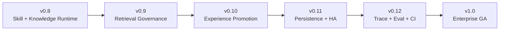

# LeeClaw Roadmap

> 当前基线：**v0.9.0 — Retrieval Governance**
>
> 本文件是 LeeClaw 后续开发的长期路线图。版本开发、Release 和架构调整以这里的边界、顺序和验收条件为准。

---

## 1. 总体目标

LeeClaw 不继续堆叠新的框架，沿一条主线演进：

```text
v0.8  Agent 能用 Skill + Knowledge                 ✅ 已完成
  ↓
v0.9  Agent 查得更准、能处理冲突、时效与完整性     ✅ 当前基线
  ↓
v0.10 Memory / Experience 受控形成候选知识和 Skill  🎯 下一版本
  ↓
v0.11 多实例、共享状态、生产持久化与任务治理       📌 规划
  ↓
v0.12 全链路 Trace / Eval / CI / 回归发布          📌 规划
  ↓
v1.0  企业生产版                                    🏁 目标
```

长期边界保持不变：

```text
OpenClaw   = 唯一人类账号 + UI + Agent Runtime + Tool Authority
WeKnora    = 企业 Knowledge Engine
OpenViking = Memory + Experience + Skill Engine
LeeClaw    = Workspace + Ontology + Retrieval + Arbitration + Governance
```

任何版本都不通过修改三个 upstream 内核完成 LeeClaw 功能。

---

## 2. 版本总览

| 版本 | 状态 | 主题 | 完成判断 |
|---|---|---|---|
| **v0.8** | ✅ 已完成 | Skill Runtime + Knowledge Runtime | Agent 可动态加载 Skill，并通过窄工具使用企业 Knowledge |
| **v0.9** | ✅ 当前基线 | Retrieval Governance | Wiki/RAG、Entity、Ontology、Business Data 可按任务路由，并显式处理冲突、时效、证据与完整性 |
| **v0.10** | 🎯 下一版本 | Experience Promotion | Memory/Experience 可形成候选 Knowledge/Skill，发布必须经过证据、冲突、评测和审核门禁 |
| **v0.11** | 📌 规划 | Enterprise Persistence & HA | Workspace、Session Binding、Audit、Ontology、Promotion 状态支持共享持久化和多实例 |
| **v0.12** | 📌 规划 | Trace + Eval + CI | Agent Run 可追踪、可重放、可评测；发布自动执行兼容与回归门禁 |
| **v1.0** | 🏁 目标 | Enterprise GA | 安全、稳定、升级、回滚、部署、审计、评测形成正式生产闭环 |

---

# 3. v0.9 — Retrieval Governance（已完成）

## 3.1 已落地主链

```text
User Query
  ↓
Workspace + Knowledge Base Scope
  ↓
KB Ontology Binding
  ↓
Request-scoped Ontology Federation
  ↓
Semantic Catalog
  ↓
Retrieval Planner v2
  ↓
required sources + supporting sources
  ↓
Business / Entity / Wiki-RAG / Ontology Retriever
  ↓
Evidence Contract v2
  ↓
Freshness / Conflict Arbiter
  ↓
Completeness Gate
  ↓
Context Pack
```

### Planner v2

Planner 负责“选什么来源、要求什么新鲜度、哪些来源必须成功”，Retriever 负责访问具体来源。Plan 已显式输出：

```text
required_sources
supporting_sources
freshness_requirement
ontology_scope
allow_fallback
blocking_issues
steps[].required
steps[].target_*
```

当前/实时业务指标优先使用 Business Data；结构化实体事实使用 Entity Graph；定义与制度解释使用 Wiki/RAG；本体类型、属性和关系约束使用 Ontology Graph。

### Entity Retriever

Entity Graph 已从展示能力进入 Agent Runtime。运行时通过独立 `EntityQuerySource` 调用 WeKnora Neo4j Adapter，支持实体定位、属性读取、关系路径和 Chunk 证据回溯，不修改 WeKnora upstream。

### Business Retriever Contract

Core 只依赖 transport-neutral `BusinessQuerySource`。当前提供通用 HTTP Gateway Adapter；后续 MCP、REST、SQL Gateway 均可在 Adapter 层实现，业务 URL、SQL 和认证细节不进入 Planner/Core。

### 多 KB 本体联合

多个 Knowledge Base 按请求范围建立 namespace 后联合 Semantic Catalog。相同 concept ID 的兼容语义可合并；相同 label 不同 ID、相同 ID 不同 label 均保留 concept-sense conflict。相关冲突进入 blocking issue，不静默覆盖。

### Evidence Contract v2

标准证据字段包括：

```text
source_type
source_id
knowledge_base_id
knowledge_id
entity_id
chunk_id
value
unit
version
effective_time
observed_at
confidence
provenance
```

### Completeness Gate

`complete=true` 已改为由必要来源和阻断问题共同决定：

```text
required source 未满足      → false
unresolved conflict         → false
相关 ontology federation 冲突 → false
supporting source 失败      → 只记录普通 Gap
RAG fallback                → 不替代实时/结构化 required source
```

## 3.2 v0.9 保留边界

- Business Retriever 已有稳定接口和 HTTP Adapter，具体 MCP/SQL Gateway 由部署环境实现；
- 多 KB 联合聚焦 Semantic Catalog 和 concept-sense conflict，不做自动跨本体推理；
- Planner v2 仍以确定性语义规则为主，复杂计划通过受约束 Refiner 扩展；
- Workspace Registry、Session State、Audit、Ontology FSRegistry 仍是单实例文件存储基线；
- 完整 GitHub CI、全链路 Trace/Eval 留到 v0.12。

---

# 4. v0.10 — Experience Promotion

## 4.1 目标

让系统从“记住了”升级为：

```text
Memory / Experience
  → 形成候选经验
  → 证据与冲突检查
  → 人工审核 / Eval
  → 发布新的 Knowledge / Skill Version
  → 可追溯、可回滚
```

核心原则：**Memory / Experience 永远不能直接写入权威 Knowledge 或共享 Skill。**

## 4.2 Promotion 主链

```text
OpenClaw Session
  ↓
OpenViking Memory / Experience
  ↓
Candidate Extractor
  ↓
Candidate Classifier
  ├─ Knowledge Candidate
  └─ Skill Candidate
  ↓
Dedup / Evidence / Conflict Check
  ↓
Promotion Gate
  ↓
Human Review / Eval
  ↓
Publish
  ├─ WeKnora / Ontology Registry
  └─ OpenViking Shared Skill
```

Knowledge Candidate 至少记录 statement、concept/entity mapping、source sessions、source evidence、workspace、author profiles、validity/time、conflict state、suggested target KB/ontology。

Skill Candidate 不直接覆盖正式 Skill，而走：

```text
Current Skill
 + Observed Experience
  ↓
Candidate Diff
  ↓
Regression Eval
  ↓
Reviewer
  ↓
New Skill Version
```

每个 Skill 版本至少记录 version、source experience、reason for change、allowed tools diff、behavior diff、eval result、reviewer、publish time、rollback target。

## 4.3 v0.10 验收门禁

- Memory 不能绕过 Promotion Gate 写正式 KB；
- Experience 不能绕过 Eval/Review 覆盖正式 Skill；
- 每个发布资产可追溯到原始 Session/Evidence；
- 冲突候选不得自动发布；
- Skill 更新有前后 Diff 和回归结果；
- 所有 Promotion 可撤销/回滚；
- 个人空间与 Workspace 共享空间严格隔离。

---

# 5. v0.11 — Enterprise Persistence & HA

## 5.1 目标

在保持上层 Contract 不变的前提下，把单实例文件状态替换为企业共享状态：

```text
Workspace Registry
Workspace Default Selection
Session Workspace Binding
LeeClaw Audit
Ontology Registry
Promotion State
```

统一抽象：

```text
WorkspaceStore
SessionBindingStore
AuditStore
OntologyRegistry
PromotionStore
```

生产实现建议 PostgreSQL，文件实现保留为 local/dev backend。

## 5.2 多实例与生产治理

需要完成：乐观锁/版本列、事务、幂等键、必要场景的 distributed lease/lock、缓存失效、schema migration、startup compatibility check。

Credential 继续只保存 secret reference：

```text
secretRef → Secret Provider → runtime credential
```

Secret Provider 支持环境变量、Kubernetes Secret 和企业 Secret Manager，业务代码不保存明文密钥。

大文件和长任务改为 Streaming Upload + Job Contract，至少具备 `job_id/status/progress/retry/idempotency/cancel/failure reason`。

生产控制增加 per-user/per-workspace rate limit、token/retrieval/tool budget、concurrency control、timeout、circuit breaker、backpressure、quota、health/readiness/dependency status。

## 5.3 v0.11 验收门禁

- 两个 Gateway 实例共享 Workspace/Session Binding 后行为一致；
- 并发修改不丢数据；
- 节点重启不丢 Session Workspace Binding；
- migration 可前滚且有明确回滚策略；
- Secret 不进入 Repo、Browser、Audit、Trace；
- 大文件不经过 base64 JSON RPC；
- Job 重试不重复创建下游资源。

---

# 6. v0.12 — Trace + Eval + CI

## 6.1 全链路 Trace

统一 `run_id / trace_id` 贯穿：

```text
OpenClaw Session
→ Skill Resolution
→ Memory Recall
→ Retrieval Planner
→ Retriever
→ Arbiter
→ Evidence
→ Tool / MCP
→ Final Answer
→ Memory Capture
```

Trace 记录决策元数据，避免记录不必要的敏感正文。

## 6.2 Replay 与 Eval

Replay 区分 deterministic replay 与 current-data re-run，避免把今天重新查询的结果冒充当时证据。

评测分层：

```text
L1 Skill Selection
L2 Retrieval Planning
L3 Evidence Precision / Recall
L4 Conflict / Freshness Arbitration
L5 Tool Choice / Safety
L6 Final Answer
L7 Promotion Regression
```

## 6.3 发布 CI

每次 PR/Release 自动执行：

```text
Go test / vet / build
JS / Plugin tests
Workspace / identity gates
Skill Runtime tests
Knowledge Runtime tests
Retrieval / Arbiter tests
Promotion tests
Upstream compatibility gate
Derived OpenClaw assembly
Full OpenClaw plugin build
E2E
Eval regression
upstream/* dirty check
```

自动生成 Release Compatibility Report。

## 6.4 v0.12 验收门禁

- 关键答案可追溯到 Evidence IDs；
- Skill 激活可解释选择原因；
- Tool 过滤/允许可追溯 Authority 交集；
- 核心回归集发布前自动运行；
- Eval 退化超过阈值禁止发布；
- upstream API 漂移在 CI 阶段发现；
- 完整 OpenClaw plugin bundle/E2E 在 CI 中真实运行。

---

# 7. v1.0 — Enterprise GA

v1.0 重点是收敛为稳定产品，不以继续加功能为目标。

必须形成：单一 OpenClaw 人类身份；Workspace/Tool/Knowledge/Memory/Skill 分层授权；最小权限 Service Credential；Tool Guardrail；完整审计；单机与 HA 部署；健康检查；重试/超时/熔断；备份恢复；migration；rollback；graceful degradation；发布 CI/Eval/canary/rollback；完整运维与开发文档。

只有 upstream 三仓零侵入、Knowledge/Skill/Memory Runtime E2E、冲突/过期/Gap/证据回溯、多实例状态一致、Trace/Eval/CI、安全回归、升级/回滚/备份恢复真实演练全部通过，才进入 `1.0.0`。

---

# 8. 版本依赖关系



顺序不随意交换：先确保检索和裁决可靠，再允许系统学习；先定义 Promotion Contract，再设计生产持久化；共享状态稳定后再建设完整 Trace/Eval；没有可重复验证的 CI/Eval 不进入 GA。

---

# 9. 长期工程铁律

## 9.1 正确逻辑覆盖错误逻辑

```text
删除错误活跃路径
→ 用唯一正确实现替换
→ 更新测试
→ 更新配置
→ 更新 README / ROADMAP / RELEASE
```

历史 Release 文档可以保留，旧活跃配置、旧门禁、旧身份路径不能继续作为 fallback。

## 9.2 每种资产只有一个 Source of Truth

- Skill：OpenViking；
- Knowledge：WeKnora；
- 人类身份：OpenClaw；
- Entity Graph：WeKnora；
- Ontology：LeeClaw Ontology Registry；
- Workspace membership/session binding：LeeClaw Workspace Core；
- 实时业务事实：业务 API/MCP/数据网关。

禁止双主。

## 9.3 上游零侵入

优先顺序：

```text
Public API / MCP
→ Plugin / Hook
→ Adapter
→ Derived Assembly
→ 最后才考虑可退出的 upstream Patch
```

## 9.4 浏览器不拥有可信身份

Browser 只能表达用户意图。`profileId / tenant / API key / OpenViking account/user / knowledge scope / tool authority` 必须由服务端解析。

---

# 10. 每版统一开发顺序

```text
Phase 1  Design Contract
Phase 2  Core Implementation
Phase 3  Adapter / Integration
Phase 4  Tests / Security Gates
Phase 5  README / ROADMAP / RELEASE / CHANGELOG
Phase 6  Upstream compatibility
Phase 7  Release
```

每一版都先写清问题、唯一正确逻辑、Source of Truth、模块职责、API/Contract、安全边界和需要删除的旧逻辑，再进入实现。