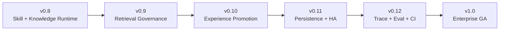

# LeeClaw Roadmap

> 当前基线：**v0.8.0 — Skill Runtime + Knowledge Runtime**
>
> 本文件是 LeeClaw 后续开发的长期路线图。所有版本开发、PR 和 Release 都应以这里的边界、顺序和验收条件为准。

---

## 1. 总体目标

LeeClaw 不继续堆叠新的框架，后续围绕一条主线演进：

```text
v0.8  Agent 能用 Skill + Knowledge
  ↓
v0.9  Agent 查得更准、能处理冲突与时效
  ↓
v0.10 Agent 能从 Memory / Experience 中形成受控的新知识和新 Skill
  ↓
v0.11 多实例、共享状态、生产级持久化与任务治理
  ↓
v0.12 全链路 Trace / Eval / CI / 回归发布
  ↓
v1.0  企业生产版
```

核心原则保持不变：

```text
OpenClaw   = 唯一人类账号 + UI + Agent Runtime + Tool Authority
WeKnora    = 企业 Knowledge Engine
OpenViking = Memory + Experience + Skill Engine
LeeClaw    = Workspace + Ontology + Retrieval + Arbitration + Governance
```

任何版本都不通过修改三个 upstream 内核来完成 LeeClaw 功能。

---

## 2. 版本总览

| 版本 | 状态 | 主题 | 版本完成的判断标准 |
|---|---|---|---|
| **v0.8** | ✅ 当前基线 | Skill Runtime + Knowledge Runtime | Agent 已能动态加载 Skill，并通过窄工具使用企业 Knowledge |
| **v0.9** | 🎯 下一版本 | Retrieval Governance | Wiki / RAG / Entity / Ontology / Business Data 能按任务正确路由，并处理冲突、时效和完整性 |
| **v0.10** | 📌 规划 | Experience Promotion | Memory / Experience 可以形成候选 Knowledge / Skill，但不能绕过审核直接污染权威资产 |
| **v0.11** | 📌 规划 | Enterprise Persistence & HA | Workspace、Session Binding、Audit、Ontology 等共享状态支持多实例和生产持久化 |
| **v0.12** | 📌 规划 | Trace + Eval + CI | 一次 Agent Run 可追踪、可重放、可评测；每次发布自动回归和兼容检查 |
| **v1.0** | 🏁 目标 | Enterprise GA | 安全、稳定、升级、回滚、部署、审计、评测形成正式生产闭环 |

---

# 3. v0.9 — Retrieval Governance

## 3.1 版本目标

v0.9 不再扩管理页面，重点把 LeeClaw 本质上的**检索策略**做完整。

目标是让 Agent 不只会“查 RAG”，而是能够判断：

```text
这个问题应该查什么？
  ↓
Wiki？
RAG Chunk？
Entity Graph？
Ontology？
实时业务 API / MCP？
  ↓
多来源结果是否冲突？
是否过期？
谁更可信？
证据是否完整？
```

### 3.2 Runtime 主链

```text
User Query
   ↓
Intent / Task Type
   ↓
Ontology + Semantic Catalog
   ↓
Retrieval Planner
   ↓
┌─────────────┬─────────────┬─────────────┬─────────────┐
│ Wiki / RAG  │ Entity Graph│ Ontology    │ Business MCP│
└─────────────┴─────────────┴─────────────┴─────────────┘
   ↓
Evidence Normalization
   ↓
Freshness / Version / Conflict Arbiter
   ↓
Completeness Gate
   ↓
Context Pack
```

## 3.3 必做模块

### A. Retrieval Planner v2

Planner 输出稳定执行计划，而不是简单的检索关键词：

```json
{
  "task_type": "fact_query",
  "required_sources": ["business", "entity"],
  "supporting_sources": ["rag", "wiki"],
  "ontology_scope": ["procurement"],
  "freshness_requirement": "live",
  "allow_fallback": true
}
```

Planner 负责“选择来源”，Retriever 负责“访问来源”，两者不能混在一起。

### B. Entity Retriever

把 Entity Graph 从“能显示”升级成 Agent 可查询的 Runtime Retriever：

- 实体定位；
- 属性读取；
- 一跳/多跳关系；
- 实体与文档证据反查；
- 结果统一转换成 Evidence Contract。

### C. Business Retriever Contract

定义统一实时业务接口：

```text
Business Retriever Interface
        ↓
MCP / REST / SQL Gateway Adapter
```

LeeClaw Core 不直接写死具体业务系统 URL、SQL 或认证方式。

### D. 三图协同

三张图职责固定：

```text
Wiki 图   → 文档结构和主题导航
实体图    → 事实实体和实体关系
本体图    → 语义类型、属性、关系、规则和数据来源
```

Planner 用本体图决定“怎么查”，Entity Retriever 用实体图找“事实关系”，Wiki/RAG 提供“解释性证据”。

### E. 多 Knowledge Base 本体联合

禁止把多个 KB 的本体图简单拼接。

应实现：

```text
KB Ontology Binding
  → namespace / concept sense 对齐
  → conflict detection
  → merged Semantic Catalog
  → request-scoped federation
```

只在当前 Workspace + 当前请求允许的 KB 范围内联合。

### F. Evidence Contract v2

所有 Retriever 统一输出：

```text
source_type
source_id
knowledge_base_id
entity_id?
chunk_id?
value?
unit?
version?
effective_time?
observed_time?
confidence
provenance
```

后续 Arbiter 不再针对各数据源写一套特殊判断。

### G. 冲突与过期裁决

至少支持：

```text
同一事实多值
文档版本冲突
新旧制度冲突
实时系统 vs 历史文档
个人 Memory vs 企业 Knowledge
实体属性 vs 文本描述
```

默认优先级不是硬编码“某系统永远最高”，而是综合：

```text
Source Authority
+ Effective Time
+ Version
+ Scope Match
+ Evidence Directness
+ Confidence
```

冲突无法自动解决时必须保留冲突，不静默选一个答案。

### H. Completeness Gate

`complete=true` 必须有明确依据。

如果 Planner 判定需要实时业务数据，而 Business Retriever 失败：

```text
RAG 找到了相关说明
≠
实时事实已经完整获取
```

必须保留 Gap。

## 3.4 v0.9 验收门禁

必须通过以下场景：

- 过期知识不能静默覆盖新版本；
- 多来源冲突可返回胜出证据、竞争证据和裁决理由；
- 实时问题优先使用实时 Business Retriever；
- Entity Graph 结果可以回溯来源；
- 多 KB 请求不能越过 Workspace / KB Scope；
- 多 KB 本体冲突不能被简单 merge 掩盖；
- 任一 required source 失败时 `complete` 不得被错误标记为 true；
- Planner / Retriever / Arbiter 都有独立合同测试。

## 3.5 v0.9 明确不做

- 不做 Memory → Knowledge 自动回流；
- 不做 Experience → Skill 自动发布；
- 不做多 Skill 自动编排；
- 不为了统一检索直接修改 WeKnora / OpenViking 内核。

原因：**先把“查得对、裁得对”做稳定，再让系统学习。**

---

# 4. v0.10 — Experience Promotion

## 4.1 版本目标

让系统从：

```text
记住了
```

升级为：

```text
形成候选经验
→ 有证据地审核
→ 发布为新的 Knowledge / Skill
→ 可追溯、可回滚
```

核心原则：

> **Memory / Experience 永远不能直接写入权威 Knowledge 或共享 Skill。**

## 4.2 Promotion 主链

```text
OpenClaw Session
   ↓
OpenViking Memory / Experience
   ↓
Candidate Extractor
   ↓
Candidate Classifier
   ├─ Knowledge Candidate
   └─ Skill Candidate
   ↓
Dedup / Evidence / Conflict Check
   ↓
Promotion Gate
   ↓
Human Review / Eval
   ↓
Publish
   ├─ WeKnora / Ontology Registry
   └─ OpenViking Shared Skill
```

## 4.3 Knowledge Candidate

候选知识至少记录：

```text
statement
concept / entity mapping
source sessions
source evidence
workspace
author profiles
validity / time
conflict state
suggested target KB / ontology
```

发布前必须经过：

- 与现有知识去重；
- 与当前有效版本冲突检查；
- 来源证据完整性检查；
- Knowledge Base / Ontology Scope 校验；
- 人工审核或配置允许的低风险自动审核。

## 4.4 Skill Candidate

Experience 不能直接覆盖正式 Skill。

应形成：

```text
Current Skill
    +
Observed Experience
    ↓
Candidate Diff
    ↓
Regression Eval
    ↓
Reviewer
    ↓
New Skill Version
```

Skill 版本至少包含：

```text
version
source experience
reason for change
allowed tools diff
behavior diff
eval result
reviewer
publish time
rollback target
```

## 4.5 个人经验与组织经验

```text
个人 Memory / Experience
  → 默认只生成个人候选

个人候选
  → 申请 Promotion
  → Workspace Review
  → 共享 Knowledge / Skill
```

不能因为一个用户的操作习惯自动改变全 Workspace 行为。

## 4.6 v0.10 验收门禁

- Memory 不能绕过 Promotion Gate 写正式 KB；
- Experience 不能绕过 Eval / Review 覆盖正式 Skill；
- 每个发布资产都能追溯到原始 Session / Evidence；
- 冲突候选不会自动发布；
- Skill 更新必须有前后 Diff 和回归结果；
- 所有 Promotion 可撤销 / 回滚；
- 个人空间与 Workspace 共享空间严格隔离。

---

# 5. v0.11 — Enterprise Persistence & HA

## 5.1 版本目标

把目前单 Gateway / 文件型状态替换成真正的企业共享状态，但**保持上层 Contract 不变**。

当前需要替换的单实例实现包括：

```text
Workspace Registry
Workspace Default Selection
Session Workspace Binding
LeeClaw Audit
Ontology FSRegistry
Promotion State
```

## 5.2 共享存储

统一抽象：

```text
WorkspaceStore
SessionBindingStore
AuditStore
OntologyRegistry
PromotionStore
```

生产实现建议使用 PostgreSQL；文件实现保留为 local/dev backend。

不让业务模块直接依赖 PostgreSQL SQL。

## 5.3 多实例一致性

实现：

- 乐观锁 / version column；
- 事务；
- 幂等 key；
- distributed lease / lock 只用于确有必要的串行任务；
- 缓存失效；
- schema migration；
- startup compatibility check。

## 5.4 Secret 与 Credential

Workspace Registry 继续只保存 secret reference：

```text
secretRef → Secret Provider → runtime credential
```

增加 Secret Provider Interface，支持：

- 环境变量；
- Kubernetes Secret；
- 企业 Secret Manager。

业务代码不读取明文配置文件中的 API Key。

## 5.5 文件与异步任务

把 v0.8 的 base64 管理文件上传替换为 authenticated streaming upload。

建立 Job Contract 处理：

- 大文件上传；
- WeKnora parse/reparse；
- Promotion；
- Ontology compile；
- 大型 graph projection。

必须支持：

```text
job_id
status
progress
retry
idempotency
cancel
failure reason
```

## 5.6 生产控制

增加：

- per-user / per-workspace rate limit；
- token / retrieval / tool budget；
- concurrency control；
- timeout / circuit breaker；
- backpressure；
- quota；
- health / readiness / dependency status。

## 5.7 v0.11 验收门禁

- 两个 LeeClaw Gateway 实例共享 Workspace / Session Binding 后行为一致；
- 并发修改不会丢数据；
- 节点重启不会丢 Session Workspace Binding；
- 数据库 migration 可前滚并有明确回滚策略；
- Secret 不出现在 Repo、Browser、Audit、Trace；
- 大文件上传不经过 base64 JSON RPC；
- Job 重试不会重复创建下游资源。

---

# 6. v0.12 — Trace + Eval + CI

## 6.1 版本目标

让 LeeClaw 从“能跑”升级到：

```text
为什么这么回答，可以看见
为什么调用这个 Skill，可以解释
为什么查这个数据源，可以追溯
为什么这个版本可以发布，有评测证据
```

## 6.2 全链路 Trace

统一 `run_id / trace_id` 贯穿：

```text
OpenClaw Session
→ Skill Resolution
→ Memory Recall
→ Retrieval Planner
→ Retriever
→ Arbiter
→ Evidence
→ Tool / MCP
→ Final Answer
→ Memory Capture
```

Trace 必须记录决策元数据，不记录不必要的敏感正文。

## 6.3 Replay

支持按 Run 重放：

```text
原始输入
+ 当时 Workspace
+ Skill Version
+ Ontology Version
+ Evidence IDs
+ Tool Contract
```

区分：

- deterministic replay；
- current-data re-run。

避免把“今天重新跑出来的结果”冒充“当时系统真实看到的证据”。

## 6.4 Eval

建立分层评测：

```text
L1  Skill Selection
L2  Retrieval Planning
L3  Evidence Precision / Recall
L4  Conflict / Freshness Arbitration
L5  Tool Choice / Safety
L6  Final Answer
L7  Promotion Regression
```

每个 Workspace 可以拥有自己的业务测试集，平台再维护公共回归集。

## 6.5 发布 CI

每次 PR / Release 自动执行：

```text
Go test / vet / build
JS / Plugin tests
Workspace / identity gates
Skill Runtime tests
Knowledge Runtime tests
Retrieval / Arbiter tests
Promotion tests
Upstream compatibility gate
Derived OpenClaw assembly
Full OpenClaw plugin build
E2E
Eval regression
upstream/* dirty check
```

自动生成 Release Compatibility Report。

## 6.6 v0.12 验收门禁

- 任一关键答案可追溯到 Evidence IDs；
- 任一自动 Skill 激活可解释选择原因；
- 任一 Tool 被过滤/允许可以追溯 Authority 交集；
- 核心回归集发布前自动运行；
- Eval 退化超过阈值禁止发布；
- upstream API 漂移能在 CI 阶段被发现；
- 完整 OpenClaw plugin bundle / E2E 真正在 CI 中运行，而不是只靠 syntax test。

---

# 7. v1.0 — Enterprise GA

v1.0 不以“再加功能”为目标，重点是把前面能力收敛成稳定产品。

## 7.1 GA 必备

### 安全

- 单一 OpenClaw 人类身份；
- Workspace / Tool / Knowledge / Memory / Skill 分层授权；
- Service Credential 最小权限；
- Tool Guardrail；
- Prompt / Skill / Memory 注入边界；
- 完整审计。

### 稳定性

- 单机与 HA 两套部署模式；
- dependency health；
- retry / timeout / circuit breaker；
- backup / restore；
- migration；
- rollback；
- graceful degradation。

### 发布治理

```text
release branch
→ CI
→ compatibility
→ eval
→ canary
→ main/tag
→ rollback target
```

### 运维

- 统一配置检查；
- 运行状态页；
- Workspace / KB / Skill / Ontology / Job 可观察；
- 关键故障告警；
- 审计查询；
- 版本和依赖信息可见。

### 文档

至少完成：

```text
Architecture
Install
Single-node deployment
HA deployment
Upgrade
Rollback
Backup / Restore
Workspace / Permission
Knowledge
Memory
Skill
Ontology
Retrieval
Promotion
Security
Troubleshooting
Developer Guide
Upstream Sync Guide
```

## 7.2 v1.0 Release Gate

只有以下条件都满足才进入 `1.0.0`：

- upstream 三仓保持零侵入；
- 单账号 / 多 Workspace 生产链稳定；
- Knowledge / Skill / Memory Runtime E2E 通过；
- 冲突、过期、Gap、证据回溯通过；
- Promotion 不存在未授权直接写主干路径；
- 多实例状态一致；
- 完整 Trace / Eval / CI 启用；
- 安全回归通过；
- 升级 / 回滚 / 备份恢复真实演练通过；
- 发布文档与实际代码一致。

---

# 8. 版本之间的依赖关系

路线顺序不要随意交换：



原因：

1. **v0.9 必须先于 v0.10**：检索和冲突裁决不可靠时，自动学习会放大错误；
2. **v0.10 必须先定义 Promotion Contract，再在 v0.11 做持久化**：先定业务语义，再定数据库结构；
3. **v0.11 必须先于正式生产评测**：Trace / Eval 要建立在稳定的 Run / Store / Job 身份上；
4. **v0.12 必须先于 v1.0**：没有可重复验证的 CI / Eval，不能宣称生产稳定。

---

# 9. 长期保持的工程铁律

## 9.1 正确逻辑覆盖错误逻辑

发现旧设计不再成立时：

```text
删除错误活跃路径
→ 用唯一正确实现替换
→ 更新测试
→ 更新配置
→ 更新 README / ROADMAP / RELEASE
```

禁止：

```text
oldLogic()
if (newMode) newLogic()
else oldLogic()
```

长期保留两套语义只会让权限、Workspace 和 Runtime 越来越不可控。

历史 Release 文档可以保留，但旧活跃配置、旧门禁、旧身份路径不能继续作为 fallback。

## 9.2 每种资产只有一个 Source of Truth

新功能开发前必须先回答：

```text
这个资产的唯一权威源在哪里？
```

禁止双主：

- Skill 不同时以 OpenClaw 本地文件和 OpenViking 为正式主数据；
- Knowledge 不同时以 LeeClaw DB 和 WeKnora 为正式主数据；
- 用户不同时维护 OpenClaw/WeKnora/OpenViking 三套账号；
- Entity Graph 和 Ontology Graph 不因为展示统一就混成一张权威图。

## 9.3 上游零侵入

优先顺序：

```text
Public API / MCP
→ Plugin / Hook
→ Adapter
→ Derived Assembly
→ 最后才考虑上游 Patch
```

若不得不 Patch upstream，必须单独设计退出方案，不把临时 Patch 当长期架构。

## 9.4 浏览器不拥有可信身份

Browser 永远不能声明：

```text
profileId
WeKnora tenant
WeKnora API key
OpenViking account
OpenViking user
Knowledge scope
Tool authority
```

浏览器只能表达用户意图，可信 Principal 必须由服务端解析。

---

# 10. 每个版本统一开发计划

以后每一版固定按以下顺序开发：

## Phase 1 — Design Contract

先写清：

- 当前问题；
- 新的唯一正确逻辑；
- Source of Truth；
- 模块职责；
- API / Contract；
- 安全边界；
- 明确删除的旧逻辑。

## Phase 2 — Core Implementation

先实现接口和核心逻辑，再接 UI。

不要从页面按钮倒推架构。

## Phase 3 — Contract Test

每一个关键边界都必须有测试：

```text
identity
workspace
permission
adapter
runtime
retrieval
arbitration
promotion
storage
```

## Phase 4 — Integration

执行：

```text
OpenClaw derived assembly
WeKnora contract
OpenViking contract
upstream compatibility
```

## Phase 5 — Product UI

UI 只调用稳定 LeeClaw Contract，不直接认识下游 API 和身份字段。

## Phase 6 — Release Gate

至少完成：

```text
unit test
contract test
integration test
security regression
upstream dirty check
README
ROADMAP
CHANGELOG
RELEASE-vX.Y.md
```

## Phase 7 — Merge

```text
release/vX.Y
→ GitHub Compare
→ upstream/* = 0 modified
→ PR
→ squash merge main
→ tag/release
```

---

# 11. ROADMAP 维护规则

为了保证每次拉取项目都能直接看到真实开发计划，本文件固定放在仓库根目录：

```text
/ROADMAP.md
```

后续每个版本的 Release PR 必须同时更新本文件：

1. 当前版本状态改为 `✅`；
2. 下一版本改为 `🎯`；
3. 已完成条目从“计划”切换为“已完成”；
4. 新发现的架构缺口写入对应后续版本；
5. 如果版本范围改变，必须写明原因，不能只改代码不改 Roadmap。

Roadmap 描述的是**当前主干真实状态和下一步计划**，不能把尚未完成的能力写成已经具备。

---

# 12. 当前下一步

当前主干是 **v0.8.0**。

下一步只聚焦：

```text
v0.9 Retrieval Governance
```

建议第一批开发顺序：

```text
1. Evidence Contract v2
2. Planner v2
3. Entity Retriever
4. Business Retriever Interface
5. Freshness / Version Arbiter
6. Conflict Arbiter
7. Completeness Gate
8. Multi-KB Semantic Catalog / Ontology Federation
9. Agent Runtime E2E
10. v0.9 Release Gate
```

在这十项没有形成稳定合同前，不提前启动自动 Knowledge / Skill Promotion。
