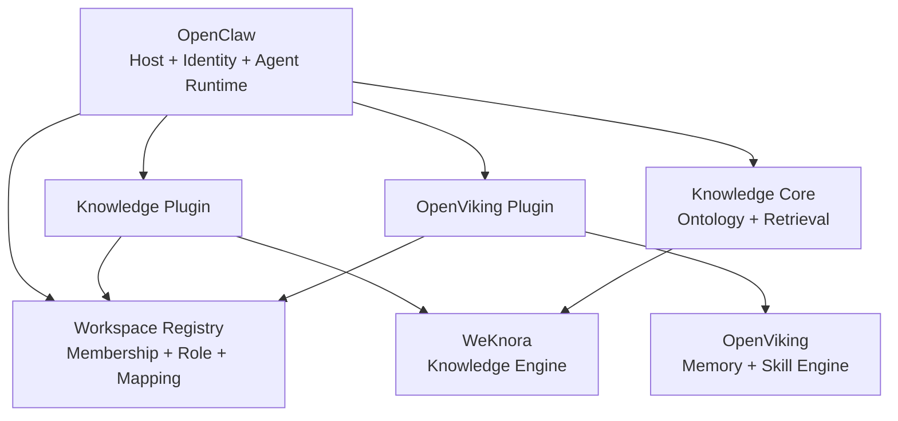

# LeeClaw v0.7 架构设计

## 1. 设计目标

v0.7 在 v0.6 的 OpenClaw 单账号主线上完成两件事：

1. 把静态单 Workspace 替换为服务端、多成员、可切换 Workspace；
2. 把 WeKnora 成熟 Knowledge 管理能力真正收进 OpenClaw 原生产品体验。

设计仍以“低耦合、可持续同步上游”为第一约束。

## 2. 系统边界



职责固定：

- OpenClaw：认证、durable profile、平台 scope、主 UI、Agent Runtime；
- Workspace Registry：成员、角色、当前 Workspace、下游 Tenant/Account 映射；
- WeKnora：KB/文档/Wiki/FAQ/Tag/RAG/Entity Graph/Organization Share 等 Knowledge Engine；
- OpenViking：Memory/Session/Experience/Trajectory/Skill；
- Knowledge Core：Ontology Registry、GraphView、Retrieval Planner/Arbiter 等自研知识治理能力。

## 3. Principal 与 Workspace

唯一人类 ID：

```text
authenticatedUserProfile.profileId
```

每次业务请求：

```text
profileId
  → WorkspaceRegistry.resolve(profileId, requestedLogicalWorkspace?)
  → membership check
  → role check
  → resolved workspace
```

resolved workspace 才能生成下游上下文：

```text
Knowledge:
  WeKnora Tenant = workspace.weknora.tenantId
  WeKnora Key    = env[workspace.weknora.apiKeyEnv]
  External User  = profileId

Memory / Skill:
  OpenViking Account = workspace.openviking.accountId
  OpenViking User    = profileId
```

OpenViking Workspace 解析本身不读取 WeKnora API Key，避免两个 Engine 因 credential 产生横向耦合。

## 4. Workspace Role

```text
viewer < editor < admin < owner
```

- viewer：只读；
- editor：KB 内容编辑；
- admin：Knowledge destructive/share 管理；
- owner：Workspace 成员治理。

Gateway 仍额外执行 OpenClaw scope：

```text
operator.read
operator.write
operator.admin
```

因此服务端授权条件为：

```text
OpenClaw platform scope
AND
Workspace role
AND
Downstream service capability / tenant boundary
```

## 5. Knowledge 管理通道

```text
Browser
  → OpenClaw Control UI Host
  → leeclaw.knowledge.*
  → Profile + Workspace Resolver
  → Role Gate
  → WeKnoraClient Adapter
  → WeKnora API
```

浏览器代码不得出现：

- `X-API-Key`；
- `X-Tenant-ID`；
- `X-OpenViking-User/Account`；
- WeKnora/OpenViking credential；
- raw downstream tenant/account override。

WeKnora API 路径集中在 `lib/weknora-client.js`。

## 6. Knowledge 功能面

v0.7 Gateway Contract 覆盖：

- KB list/get/create/update/delete；
- document list/file/url/manual/delete/reparse/cancel/folders；
- tag list/create/update/delete；
- FAQ list/create/update/delete；
- Wiki list/create/update/delete；
- hybrid search；
- organization/share list/create/update/delete；
- entity/ontology GraphView；
- Workspace-scoped LeeClaw audit。

API 增量只应该新增 Adapter Method + Gateway Contract + UI 调用，不应把 WeKnora SDK/route path 散落到浏览器。

## 7. 为什么审计由 LeeClaw 自己做

WeKnora `/knowledge-bases/:id/activity` 当前是 JWT owner/admin 路由，故不能在“OpenClaw 单账号 + WeKnora API Principal”模式下当作通用审计接口。

v0.7 删除该错误调用，审计改由 Gateway 记录：

```text
actor profileId
workspaceId
action
resource type/id
outcome
time
```

敏感 payload 不入审计。当前后端为 JSONL 单 Gateway 实现；未来可以替换 AuditStore，不改变 Gateway Contract。

## 8. Memory 与 Workspace 切换

Memory Runtime 不使用浏览器当前页面状态，而按 Session Owner profile 读取服务端 Workspace selection：

```text
OpenClaw Session.createdActor(profileId)
  → Workspace Registry current selection
  → OpenViking Account/User
  → recall / capture / commit
```

这样 Workspace 切换同时影响页面查询和 Chat Memory，并防止不同用户共享 Memory principal。

## 9. Skill

Skill Source of Truth 仍是 OpenViking。

v0.7 保持：

```text
list → find → read L2/SKILL.md
```

不将 Skill 同步成 OpenClaw 本地第二份权威资产。未来 Skill Runtime 通过 Adapter 动态加载，不修改 OpenClaw Skill 内核或 OpenViking存储模型。

## 10. Ontology

Ontology Registry 与 WeKnora 生命周期继续分离：

```text
Entity Graph → WeKnora
Ontology     → LeeClaw Registry
```

产品统一展示为 `Knowledge -> Entity Graph / Ontology Graph`，统一 `GraphView` Contract。

## 11. 存储边界

v0.7 当前：

- Workspace Registry：JSON 文件；
- Workspace selection：JSON 文件；
- Knowledge operation audit：JSONL；
- Ontology Registry：FSRegistry；
- WeKnora/OpenViking：各自原生存储。

前三项/本体 Registry 均已经通过逻辑接口隔离。单 Gateway 可用；多 Gateway/HA 时应替换为 PostgreSQL/集中审计，不引入网络共享文件的伪一致性方案。

## 12. 上游升级规则

允许的 LeeClaw 变更位置：

```text
integrations/
internal/
configs/
compatibility/
scripts/
docs/
```

禁止把 LeeClaw 功能代码写入 `upstream/*`。

升级门禁：

```text
upstream pin update
  → compatibility scan
  → contract tests
  → derived OpenClaw assembly
  → full CI/E2E
```

若上游接口漂移，差异优先由 Adapter 吸收。
