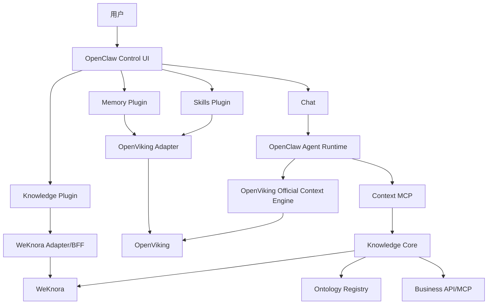
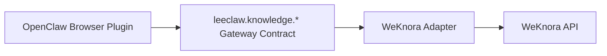
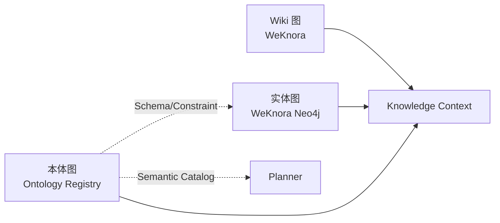
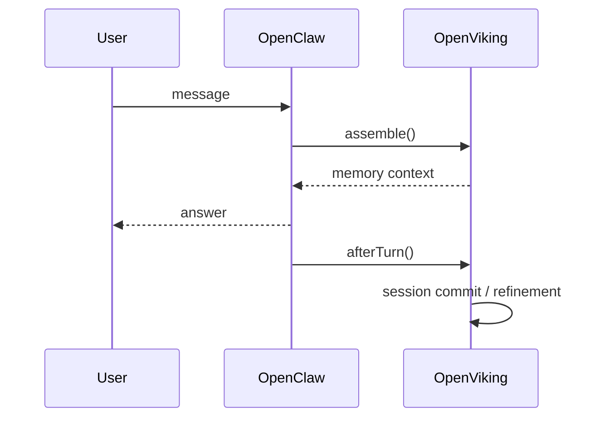
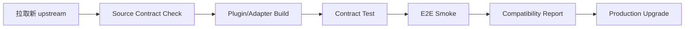

# LeeClaw v0.5 架构设计

## 1. 目标

v0.5 将 OpenClaw、WeKnora、OpenViking 与既有 Knowledge Core 组合为一个可持续演进的 Agent 产品骨架。

核心不是“把三个页面放在一起”，而是建立四个稳定边界：

- **OpenClaw**：主界面与 Agent Runtime；
- **WeKnora**：企业 Knowledge Engine；
- **OpenViking**：Memory + Skill Engine；
- **自研 Knowledge Core**：Ontology、Retrieval Planner、Arbiter、Context 与后续 Promotion。

## 2. 总体架构



## 3. 为什么 OpenClaw 是主干，但不能成为所有能力的实现者

OpenClaw 管理 Agent Loop、模型、工具、MCP、会话与 Control UI。Knowledge、Memory、Skill 都通过官方 Plugin 扩展进入它的产品界面。

因此 OpenClaw 是统一宿主，而不是新的知识库、记忆库或 Skill 数据库。

这种模式保证：

```text
OpenClaw 升级    -> 验证 Plugin SDK
WeKnora 升级     -> 验证/修改 WeKnora Adapter
OpenViking 升级  -> 验证/修改 OpenViking Adapter
```

三条升级路径互不扩散。

## 4. Knowledge 管理面

Knowledge Plugin 是 OpenClaw 原生 Control UI，不 iframe WeKnora 页面。



浏览器层禁止出现 WeKnora URL/API 路径。

WeKnora 仍为以下能力的最终权威：

- Knowledge Base 生命周期；
- Document/Folder/Tag/FAQ/Wiki；
- Tenant/Workspace；
- Members/Invitation；
- Organization/Sharing；
- RAG/GraphRAG；
- Entity Graph；
- Audit；
- 最终授权判定。

OpenClaw UI 可以根据 Adapter 返回的能力决定显示按钮，但不能替代 WeKnora 后端授权。

## 5. Agent 检索面

Knowledge 管理 API 与 Agent Retrieval 必须分离：

```text
人 -> Knowledge UI -> Adapter -> WeKnora Management API

Agent -> Context MCP -> Planner -> Retriever -> Arbiter -> Context Pack
```

Agent 不应看到大量底层 WeKnora 管理工具。

生产主工具继续保持窄接口：

```text
context.retrieve
context.get_evidence
```

后续可增加受控 `context.expand`，但不把 Neo4j/Cypher/WeKnora CRUD 直接暴露给模型。

## 6. 三图体系



产品 UI 上三者都属于 Knowledge；存储与生命周期保持独立。

### 实体图

WeKnora GraphRAG 的运行事实图。v0.5 继续只读其 Neo4j Schema。

### 本体图

自研治理资产，沿用 v0.4：

```text
Candidate -> Approved -> Register -> Published -> active/pinned -> KB
```

OpenClaw Knowledge 页面直接消费统一 `GraphView`，因此不需要把本体写入 WeKnora Neo4j。

## 7. Memory

Memory Runtime 不自行实现，直接使用 OpenViking 官方 OpenClaw context-engine：



OpenClaw 中新增的 Memory 页面只是管理/查看 UI，走 OpenViking Adapter。

## 8. Skill

Skill Source of Truth 设在 OpenViking。

```text
viking://user/{user_id}/skills
viking://agent/skills
```

运行时优先利用 OpenViking 官方插件提供的 `ov_search / ov_read / ov_multi_read` 按需发现和读取 Skill，避免启动时复制整个 Skill 库到 OpenClaw。

OpenClaw 本地若产生缓存，缓存永远不是权威副本。

## 9. Workspace 与身份

v0.5 不让三个系统共享用户表或数据库主键。

```text
OpenClaw authenticated user
        │
        ├─ Knowledge Adapter -> X-External-User-ID / signed identity -> WeKnora
        │
        └─ OpenViking Adapter -> X-OpenViking-User

Deployment workspace
        ├─ X-Tenant-ID -> WeKnora
        └─ X-OpenViking-Account -> OpenViking
```

当前版本通过配置完成 Workspace/Account 映射。后续若增加统一 Workspace Switcher，应新增一个很薄的 Runtime Scope Contract，而不是让 UI 直接传播 WeKnora 数据库 ID。

安全要求：WeKnora `direct_header` 仅限可信服务器到服务器调用；面向真实终端用户应采用 JWT 或 `signed_token` API Principal。

## 10. 上游修改原则

### OpenClaw

v0.5 不修改其 Runtime/Core UI 源文件。通过 Control UI Plugin 和 Gateway Method 扩展。

### WeKnora

v0.5 不修改其后端。原 v0.3 的 WeKnora GraphExplorer Overlay 继续保留兼容，但 v0.5 的新 OpenClaw Knowledge 页面不需要继续扩大这个 Patch 面。

### OpenViking

v0.5 不修改其 Memory Engine，也不 vendoring 官方 context-engine 插件。

## 11. 派生构建

```text
clean OpenClaw upstream
        │ copy
        ▼
derived build tree
        │
        ├─ extensions/leeclaw-knowledge
        └─ extensions/leeclaw-openviking
```

`apply-integration.sh` 只操作派生目录；upstream 可以直接更新后重新生成。

## 12. Compatibility Gate

v0.5 明确记录当前验证快照：

```text
OpenClaw  2026.9.3
WeKnora   0.8.0
OpenViking OpenClaw Plugin 2026.6.18
```

升级流程：



优先修改 Adapter，禁止为适配新版本把差异扩散到业务页面和 Agent Runtime。

## 13. v0.5 当前实现与后续边界

v0.5 先完成组合骨架、核心读取/创建能力、图谱、用户/共享/审计视图以及 Memory/Skill 原生页。

WeKnora 的文件上传、FAQ、Datasource、完整邀请/成员角色/分享写操作等高级管理能力后续继续在 `Knowledge Contract -> Adapter` 内补齐。它们是同一架构的增量功能，不需要再次改变总体设计。

Memory -> Knowledge Promotion 也暂不自动发布，只保留后续治理入口，避免模型精炼内容未经 Evidence/Conflict 校验直接污染企业知识。
