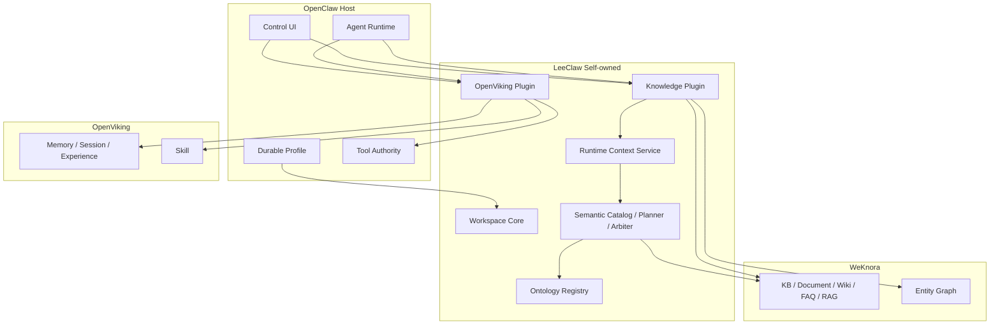

# LeeClaw v0.8 架构设计

## 1. 设计目标

v0.8 从“管理面组合”进入“Agent Runtime 组合”。目标不是再增加一个平台，而是让 OpenClaw 在保持自身 Agent 主干和安全边界的前提下，真正使用 OpenViking Skill 与 WeKnora 企业 Knowledge。

设计约束：

1. OpenClaw 是唯一人类账号源和最终 Agent Tool Authority；
2. Skill 在 OpenViking，Knowledge 在 WeKnora，本体在 LeeClaw Ontology Registry；
3. Agent 运行时的身份和 Workspace 只能从服务端 Session 恢复，模型和浏览器不能声明；
4. Skill 只能收窄 Tool Surface，不能扩权；
5. Knowledge Evidence 必须在返回时再次校验 Workspace / KB Scope；
6. 三个 upstream 保持零源码修改，版本差异只吸收到 Plugin / Adapter / Contract 层。

## 2. 分层架构



## 3. Workspace Contract

### 3.1 Profile Default Workspace

管理面维护：

```text
profileId -> default workspaceId
```

它用于 UI 请求和新 Agent Session 的初始空间。

### 3.2 Session Workspace Binding

Agent Session 运行时不直接读取“当前页面 Workspace”。

```text
sessionKey
  → OpenClaw SessionEntry.createdActor(source=profile)
  → profileId

sessionId
  → LeeClaw session binding
  → workspaceId
```

首次访问时绑定当前 default Workspace；后续保持不变。

`sessionId` 优先作为会话生命周期标识，因为 OpenClaw 在 `/new` 和 `/reset` 后会生成新的 session UUID。缺少 `sessionId` 时才退到 `sessionKey`。状态文件只保存哈希后的 Session Key，不保存原始 session id。

### 3.3 Fail Closed

Session binding 已存在时：

- profile 不匹配：拒绝；
- Workspace membership 已被撤销：拒绝；
- 绑定 Workspace 不存在：拒绝；
- 不会自动切换到另一个 Workspace。

因此 Workspace 切换不会把已有聊天历史带入新的知识域。

## 4. Principal

### Knowledge Principal

```text
userId              = OpenClaw profileId
workspaceId         = Session-bound workspace
workspaceRole       = Workspace role
tenantId             = workspace.weknora.tenantId
weknoraApiKey        = env[workspace.weknora.apiKeyEnv]
knowledgeBaseIds     = workspace.weknora.knowledgeBaseIds
```

### OpenViking Principal

```text
userId              = OpenClaw profileId
accountId           = workspace.openviking.accountId
workspaceId         = Session-bound workspace
```

Browser / Tool input 均不能覆盖 Principal 字段。

## 5. Skill Runtime

### 5.1 Discover

`before_prompt_build` 收到用户 prompt 后：

```text
OpenViking /api/v1/skills/find
query = user prompt
level = [0, 1]
score_threshold = configured threshold
```

候选排序：

```text
user skill first
  → shared agent skill
  → score desc
  → name
```

### 5.2 Load

只加载胜出 Skill：

```text
GET /api/v1/skills/{name}
level=2
include_content=true
include_files=true
```

v0.8 使用完整 `SKILL.md` 正文作为当前 Turn 的执行规程，但不会自动执行辅助文件。

### 5.3 Tool Authority

OpenClaw `before_prompt_build` hook 使用：

```text
requiresToolAuthority = true
```

Skill `allowed-tools` 经确定性别名映射后，只保留：

```text
toolAuthority.allows(toolName) == true
```

最终通过 hook result `toolsAllow` 进一步缩小当前 Turn Tool Surface。

安全不变量：

```text
Skill tool set ⊆ OpenClaw approved tool set
```

显式空 `allowed-tools` = 空可选工具集合。

参数级表达如 `Bash(git:*)` 在 Host 没有等价参数策略时直接忽略，禁止扩大为 unrestricted `exec`。

## 6. Memory 与 Skill 共用一个 Runtime Hook

Memory Recall 和 Skill Resolve 统一在同一个 `before_prompt_build` 中执行，避免多个 hook 独立返回 `toolsAllow` / Prompt Context 造成组合顺序不明确。

```text
before_prompt_build
├─ resolve Session Principal
├─ Memory Recall
├─ Skill Resolve
├─ Skill Load
├─ Host Tool Authority Intersection
└─ prependContext + optional toolsAllow
```

Memory Capture 仍独立运行：

```text
agent_end    → capture / commit
before_reset → flush pending memory
```

OpenViking Session ID 使用 `Workspace + User + OpenClaw sessionId` 派生，因此 `/reset` 后不会继续写入旧会话 Memory Session。

## 7. Knowledge Runtime Tool Surface

只向 Agent 暴露：

```text
leeclaw_context_retrieve
leeclaw_context_get_evidence
```

Tool Factory 使用 OpenClaw 提供的可信 `sessionKey/sessionId` 解析 Session Principal。Tool JSON Schema 不含：

```text
workspaceId
tenantId
accountId
userId
externalUserId
apiKey
runtimeToken
```

## 8. Runtime Context Service

调用链：

```text
OpenClaw Knowledge Tool
  → ContextRuntimeClient
  → internal Runtime Bearer
  → LeeClaw Core API
  → runtimecontext.Service
```

内部 Principal 由 Knowledge Plugin 生成，Core API 不从请求 body 接受身份字段。

### Retrieve

```text
query
+ Workspace-scoped KB IDs
  ↓
resolve KB Ontology when exactly one KB
  ↓
Compile Semantic Catalog
  ↓
Planner
  ↓
WeKnora RAG Retriever
+ Ontology Retriever when bound
  ↓
Arbiter
  ↓
Context Pack
```

### Evidence

`get_evidence` 不只按 chunk id 读取。流程为：

```text
chunk_id
  ↓
WeKnora GetChunk
  ↓
read returned knowledge_base_id
  ↓
if Workspace has explicit KB allowlist:
    knowledge_base_id must belong to allowlist
  ↓
return evidence
```

这样即使模型知道另一个 KB 的 chunk id，也不能用 Evidence Tool 绕过 Workspace Scope。

## 9. Knowledge Source Arbitration

v0.8 已有的 Source 语义继续保持：

```text
Business Data > Entity Graph > WeKnora RAG
```

实际是否可用由 Retriever 注册情况决定。

如果 Planner 选择结构化来源但该 Retriever 尚未接入，Runtime 可以补一次 WeKnora RAG 作为文档证据；原 `Gap` 和 `complete=false` 必须保留。

禁止：

```text
“文档里提到了某值”
=> 自动当成“当前业务系统事实”
```

## 10. Ontology

Ontology Registry 保持独立生命周期：

```text
Candidate
→ Immutable Version
→ Publish
→ Active / Pinned
→ KB Binding
→ Rollback / Audit
```

Runtime 只有在请求明确落到一个 KB 时解析该 KB Binding。多 KB Ontology merge 暂不实现，以避免 class/property sense 冲突被静默合并。

## 11. 管理面与运行面隔离

### 管理面

```text
OpenClaw UI
→ leeclaw.knowledge.*
→ Workspace Role
→ WeKnora Adapter
```

### 运行面

```text
Agent Tool
→ Session-bound Principal
→ Runtime Token
→ LeeClaw Core
→ Retriever / Evidence
```

两者不互相复用浏览器 Token，也不允许 Agent 调用 WeKnora 管理 API。

## 12. 低耦合规则

### OpenClaw

只使用正式 Plugin / Hook / Tool Contract：

- `registerTool`
- `before_prompt_build`
- `toolsAllow`
- `PluginHookToolAuthority`
- Session `createdActor`

不修改 Agent Loop 主干。

### WeKnora

只通过 HTTP Adapter 使用：

- Knowledge management APIs
- knowledge-search
- chunk-by-id
- graph source

不复制其数据库和权限实现。

### OpenViking

只通过 trusted principal + Skills/Session/Search API 使用，不修改 Memory/Skill 存储模型。

## 13. Upstream Compatibility Gate

v0.8 必须验证：

### OpenClaw

```text
authenticatedUserProfile.profileId
SessionEntry.createdActor source=profile
tool factory sessionKey/sessionId
registerTool
before_prompt_build.toolsAllow
requiresToolAuthority
PluginHookToolAuthority.allows/assertActive
```

### WeKnora

```text
Tenant API Key
X-Tenant-ID
X-External-User-ID
KnowledgeBaseIDs / Capabilities
knowledge-search
chunks/by-id
```

### OpenViking

```text
trusted auth
X-OpenViking-Account
X-OpenViking-User
skills/find score_threshold
L2 Skill read
allowed-tools / allowed_tools_declared
sessions/search APIs
```

任何契约消失，升级门禁直接失败，差异只能在 LeeClaw Adapter/Plugin 层吸收。

## 14. 当前限制

v0.8 不宣称完成以下能力：

- Skill auxiliary file 自动执行；
- 多 Skill 编排；
- 多 KB Ontology merge；
- 通用 Entity Retriever / Business Retriever；
- Memory → Knowledge Promotion；
- Experience → Shared Skill 自动发布；
- HA Workspace/Registry/Audit；
- 完整生产 CI/E2E/Eval。

这些都属于后续增量能力，不需要改变 v0.8 的主架构。
