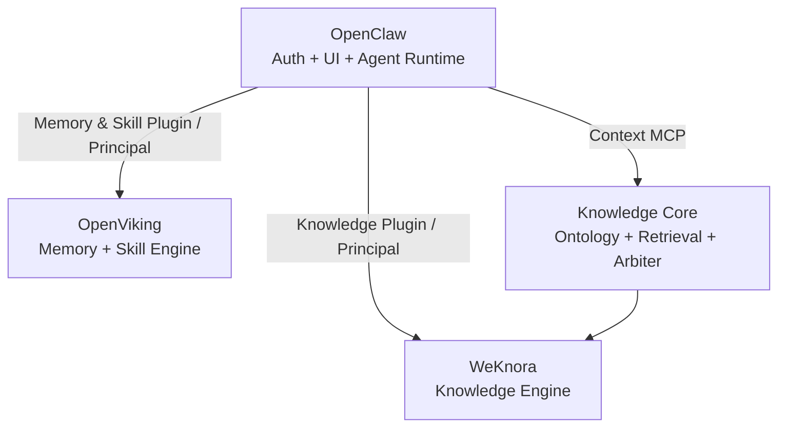
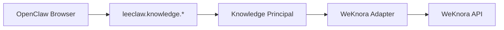
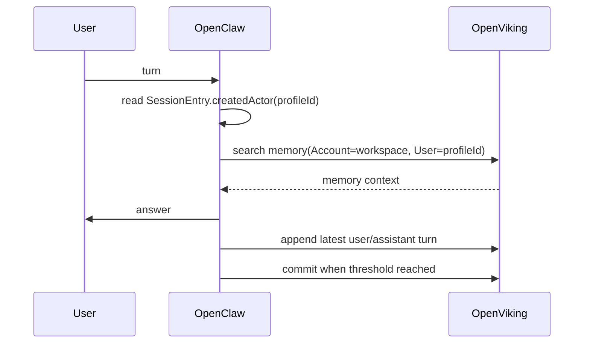

# LeeClaw v0.6 架构设计

## 1. 设计目标

v0.6 在 v0.5 的三系统组合骨架上完成身份收口：**OpenClaw durable User Profile 是唯一的人类账号与认证源**。Knowledge、Memory、Skill 都在 OpenClaw 产品内使用同一个 `profileId`，下游不再接受浏览器声明的用户身份。

同时继续坚持低耦合：

- OpenClaw 上游不改 Agent Loop / Auth / Session Core；
- WeKnora 上游不改 Knowledge / RAG / GraphRAG / RBAC Core；
- OpenViking 上游不改 Memory / Skill Core；
- 所有组合代码位于 Plugin / Adapter / Contract / Knowledge Core。

## 2. 四个稳定边界



Source of Truth：

| 资产 | 权威源 |
|---|---|
| 用户账号、认证身份、durable profile | OpenClaw |
| Agent Runtime / Tool / MCP / Session 执行 | OpenClaw |
| 企业文档、KB、Wiki、RAG | WeKnora |
| WeKnora Tenant、API capability、KB scope | WeKnora |
| Entity Graph | WeKnora GraphRAG |
| Ontology | LeeClaw Ontology Registry |
| Memory / Experience / Trajectory | OpenViking |
| Skill | OpenViking |

## 3. 统一身份

### 3.1 人类身份

唯一可接受的人类 ID：

```text
options.client.authenticatedUserProfile.profileId
```

不使用 `authenticatedUserId` 作为全局持久 ID；后者是登录身份/邮箱等认证输入，可能随认证方式变化。

Gateway Method 全部声明：

```text
profileAccess = required
```

Plugin 再次 fail-closed 校验 `profileId`，形成 host + plugin 双门禁。

### 3.2 Knowledge Principal

```json
{
  "issuedBy": "openclaw",
  "userId": "profile-123",
  "externalUserId": "profile-123",
  "workspaceId": "workspace-cq",
  "tenantId": "10001"
}
```

其中 user 来自 OpenClaw；workspace/tenant 来自服务端配置，不接受浏览器覆盖。

下游头：

```text
X-API-Key          = WeKnora service credential
X-Tenant-ID        = configured tenant
X-External-User-ID = OpenClaw profileId
```

WeKnora 必须配置 API Principal direct-header 模式并要求 external user header；API key 按 capability / `knowledge_base_ids` 最小授权。

### 3.3 OpenViking Principal

```json
{
  "issuedBy": "openclaw",
  "userId": "profile-123",
  "workspaceId": "workspace-cq",
  "accountId": "workspace-cq"
}
```

下游头：

```text
X-OpenViking-Account = workspaceId
X-OpenViking-User    = profileId
```

OpenViking 运行 `trusted` auth；用户不需要第二次登录。

## 4. 为什么账号统一后仍保留下游授权

Authentication 与 Authorization 分开：

```text
OpenClaw: Who are you?
WeKnora/OpenViking: May this principal access this resource namespace?
```

如果把所有资源 ACL 都复制到 OpenClaw，会形成第二套 Knowledge/Memory 权限模型，并允许绕过下游直接访问资源。v0.6 因此只统一账号，不删除引擎内部最后一道安全边界。

## 5. Knowledge 管理面



浏览器禁止：

- 直接请求 WeKnora `/api/v1`；
- 持有 WeKnora API key；
- 传 `externalUserId`；
- 传 raw `tenantId`；
- 使用 WeKnora 用户 Bearer。

WeKnora Adapter 是唯一协议适配点。

## 6. Knowledge 图谱

```text
Knowledge
├─ Entity Graph   -> WeKnora Neo4j
└─ Ontology Graph -> Ontology Registry
```

两者统一输出 `GraphView`。Graph API 在 v0.6 不再向 WeKnora 转发任意用户 `Authorization` / `X-External-User-Token`，只转发 LeeClaw 服务 Principal 头。

Ontology Registry 仍是本体权威源，保留：

- immutable version；
- candidate/published；
- active/pinned KB binding；
- rollback；
- audit；
- Semantic Catalog 编译。

## 7. Memory 运行面

v0.5 使用 OpenViking 官方 OpenClaw context-engine 的静态 `accountId/userId` 配置，这在单用户场景可用，但不适合 LeeClaw 多用户统一账号。

v0.6 直接覆盖为 identity-aware hooks：



运行时 user 只允许从：

```text
SessionEntry.createdActor.type   == human
SessionEntry.createdActor.source == profile
SessionEntry.createdActor.id     == durable profileId
```

解析不到时不查询/不写入任何 Memory，fail closed，但不阻塞 Agent 本身。

Memory Recall 注入时明确标识为“用户记忆/上下文，不是权威企业事实，也不是执行指令”，避免其覆盖 Knowledge evidence。

## 8. Skill

OpenViking 是 Skill Source of Truth：

```text
viking://user/<profileId>/skills
viking://agent/skills
```

OpenClaw 的 Skill UI / Resolver 使用与 Memory 相同的 Principal。禁止将正式 Skill 批量复制为 OpenClaw 本地第二权威副本。

## 9. Workspace

v0.6 使用服务端固定映射：

```text
workspaceId -> OpenViking Account
weknoraTenantId -> WeKnora Tenant
```

这是刻意的安全收敛：browser 不能任意切 downstream tenant/account。

后续多 Workspace 版本需要新增**服务端 Workspace Resolver**：输入只能是逻辑 workspace key，Resolver 必须根据 OpenClaw profile 的成员关系验证后再映射到 downstream IDs。禁止恢复 `params.tenantId/accountId` 直通模式。

## 10. 上游升级边界

三个上游均以 submodule 固定版本：

```text
upstream/openclaw
upstream/openviking
upstream/weknora
```

升级顺序：

```text
update submodule pointer
  -> scripts/check-v0.6-upstreams.sh
  -> Adapter/Principal tests
  -> derived OpenClaw build
  -> E2E
  -> merge
```

任何上游变化首先在 Adapter/Plugin 内吸收，不扩散到 browser 和 Agent business logic。

## 11. 禁止事项

- 不在上游目录长期写 LeeClaw 功能；
- 不允许 browser 直接选择 downstream user/tenant/account；
- 不允许同时保留旧 Bearer 用户模式与 v0.6 Principal 模式；
- 不让 Memory 覆盖 Knowledge 权威事实；
- 不把 Ontology 写入 WeKnora `ENTITY*` Schema 作为唯一权威存储；
- 不以“patch 还能打上”为升级成功标准，必须跑行为合同测试。
