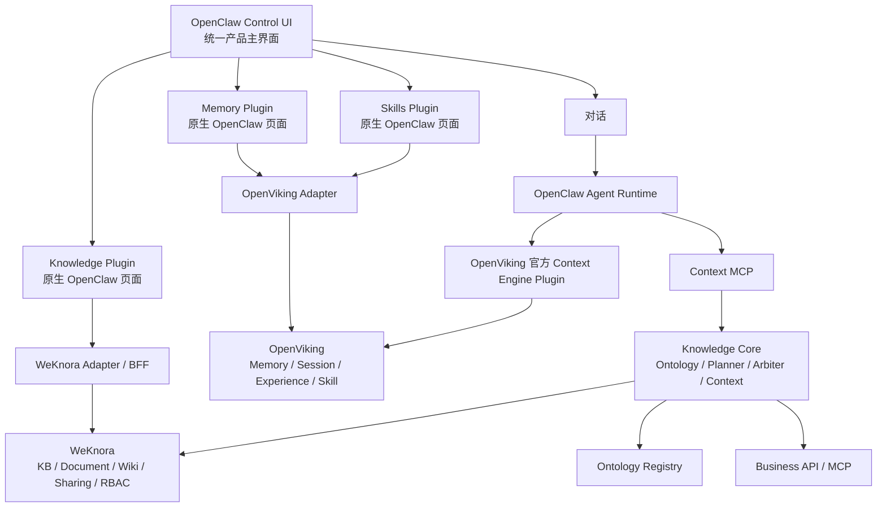

# LeeClaw Knowledge Core v0.5

> OpenClaw 为 Agent 主干，WeKnora 为企业知识引擎，OpenViking 为 Memory + Skill 引擎；本目录保留历史 `cobra-knowledge` 工程名，以避免 v0.5 为改名引入无关风险。

v0.5 的目标不是把三套上游揉成一个 Fork，而是把它们通过 **OpenClaw Plugin + Adapter Contract + 独立知识治理内核** 组装成一个可持续升级的产品骨架。

## v0.5 总体结构



## v0.5 已实现

### OpenClaw 原生 Knowledge 页面

`integrations/openclaw/knowledge-plugin` 是正式 OpenClaw Control UI Plugin，不使用 iframe，不复制 WeKnora Vue 页面。

当前提供：

- 知识库列表与创建；
- 文档列表与解析状态查看；
- Wiki 页面列表；
- 实体图 / 本体图统一查看；
- Workspace 成员查看；
- Knowledge Base 分享关系查看；
- Knowledge Base 审计活动查看。

浏览器代码只调用 `leeclaw.knowledge.*` Gateway 方法，不包含 WeKnora `/api/v1/...` 路径。WeKnora API 变化由插件 runtime 的 Adapter 层吸收。

### OpenClaw 原生 Memory / Skills 页面

`integrations/openclaw/openviking-plugin` 提供两个原生 Control UI Tab：

- `Memory`：最近 Session 与长期记忆检索；
- `Skills`：Skill 列表、语义查找与 `SKILL.md` 查看。

Skill 的唯一权威源仍为 OpenViking：

```text
viking://user/{user_id}/skills   个人 Skill
viking://agent/skills            Account/Agent 共享 Skill
```

### OpenViking 仍负责真正的 Memory Runtime

v0.5 **不重新实现** OpenViking 的记忆生命周期。Agent Runtime 使用 OpenViking 官方 `@openviking/openclaw-plugin`：

```text
assemble   -> 回复前召回 Memory

afterTurn -> 每轮对话写 Session

compact    -> Commit / 精炼长期 Memory
```

建议仅召回 `user + agent`，保持 `enableAddResourceTool=false`，避免把企业知识同时维护到 OpenViking Resources 与 WeKnora 两处。

### 本体图继续属于 Knowledge

现有 Ontology Registry、版本发布、KB Binding、回滚以及 `Ontology -> GraphView` 全部保留。

OpenClaw Knowledge 页面中的图谱结构为：

```text
Knowledge
└── 图谱
    ├── 实体图 -> WeKnora Neo4j / GraphRAG
    └── 本体图 -> Ontology Registry
```

两种图继续使用稳定 `GraphView` 契约，UI 不知道底层 Neo4j 或本体存储格式。

## 低耦合边界

| 资产/能力 | Source of Truth | v0.5 接入方式 |
|---|---|---|
| Agent Runtime | OpenClaw | 原生，不改运行主干 |
| 企业知识库/文档/Wiki | WeKnora | Knowledge Adapter |
| Knowledge 用户/成员/共享/隔离 | WeKnora | 权限头 + API，后端最终裁决 |
| Entity Graph | WeKnora | Graph Adapter，只读 |
| Ontology | 自研 Ontology Registry | GraphView / Semantic Catalog |
| Memory/Session/Experience | OpenViking | 官方 Context Engine + Adapter |
| Skill | OpenViking | `/api/v1/skills` + 官方 `ov_*` 工具 |
| 实时业务数据 | Business API/MCP | Retrieval Planner 按需调用 |

四条工程规则：

1. 上游已有 Plugin/API 的能力，不修改上游内核；
2. OpenClaw 浏览器页面不直接调用 WeKnora/OpenViking API；
3. 每类资产只有一个 Source of Truth；
4. 上游升级由 Contract Test / Compatibility Gate 先验证，差异优先收敛在 Adapter。

## 目录

```text
cobra-knowledge/
├── internal/                         # 既有 Knowledge Core
├── cmd/                              # CLI / Context MCP / Graph API
├── integrations/
│   ├── openclaw/
│   │   ├── knowledge-plugin/         # OpenClaw 原生 Knowledge UI + WeKnora BFF
│   │   ├── openviking-plugin/        # OpenClaw 原生 Memory / Skills UI
│   │   └── apply-integration.sh      # 从干净 OpenClaw 生成派生构建树
│   ├── openviking/                   # 官方 Context Engine 接入说明
│   └── weknora/                      # 历史 v0.3 WeKnora 图谱 Overlay
├── compatibility/
│   └── upstreams-v0.5.json
├── scripts/
│   ├── check-v0.5-upstreams.sh
│   └── verify-v0.5.sh
├── configs/
│   └── openclaw-v0.5.example.json
└── docs/
    └── V0.5_INTEGRATION.md
```

## 快速验证

```bash
make verify
```

包含：

- `go test ./...`
- `go vet ./...`
- 三个 Go 二进制构建
- 新增 JavaScript 语法检查
- WeKnora Adapter mock contract test
- OpenViking Adapter mock contract test
- 浏览器层禁止直连上游 API 检查

如已准备三套上游源码，再执行：

```bash
./scripts/check-v0.5-upstreams.sh \
  /path/to/openclaw \
  /path/to/weknora \
  /path/to/openviking
```

## 派生 OpenClaw 构建树

```bash
./integrations/openclaw/apply-integration.sh \
  /path/to/clean-openclaw \
  /path/to/build/openclaw-v0.5
```

脚本只复制干净 OpenClaw 到派生目录，并新增：

```text
extensions/leeclaw-knowledge
extensions/leeclaw-openviking
```

**不会回写 OpenClaw upstream。** OpenClaw 当前 `pnpm-workspace.yaml` 已包含 `extensions/*`，因此不需要修改 Workspace 配置。

OpenViking 的官方 context-engine 插件继续按其官方安装/升级流程管理，不 vendoring 到本项目。

## 身份与隔离

Knowledge Adapter 支持：

- `Authorization: Bearer ...`
- `X-API-Key`
- `X-Tenant-ID`
- `X-External-User-ID`

现有 Graph API 的 WeKnora 权限委托也同步支持：

- `Authorization`
- `X-API-Key`
- `X-Tenant-ID`
- `X-External-User-ID`
- `X-External-User-Token`

生产环境若需要真正的终端用户级权限映射，优先采用 WeKnora 的 JWT 或 `signed_token` API Principal。`direct_header` 只适合可信服务端链路，不应暴露给不可信浏览器。

OpenViking UI Adapter 支持：

- `X-OpenViking-Account`
- `X-OpenViking-User`

长期目标是将当前企业 Workspace 稳定映射为 OpenViking Account，而不是让三个系统直接共享数据库 ID。

## 配置示例

参考：

```text
configs/openclaw-v0.5.example.json
```

其中 OpenViking 官方插件占用：

```text
plugins.slots.contextEngine = openviking
```

## 当前边界

v0.5 的重点是建立**正确的组合骨架和升级边界**。Knowledge 页面已经覆盖核心读取、创建、图谱、成员/分享/审计管理视图，但还没有把 WeKnora 所有高级写操作全部重做一遍。

后续文件上传、Chunk 编辑、FAQ、Datasource、邀请、成员角色写入、分享写操作等，都应该继续沿现有 `Knowledge UI -> Gateway Contract -> WeKnora Adapter` 路径扩展；不需要修改 OpenClaw Runtime，也不应该复制 WeKnora 后端规则。

完整设计见 `ARCHITECTURE.md` 与 `docs/V0.5_INTEGRATION.md`。
